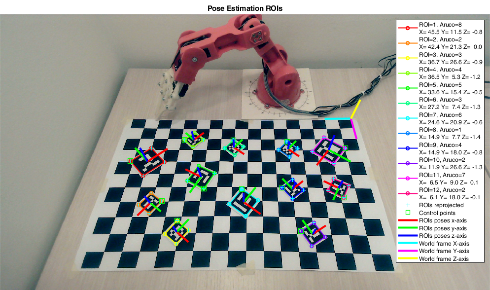
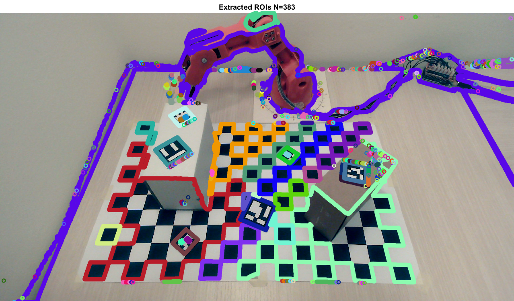
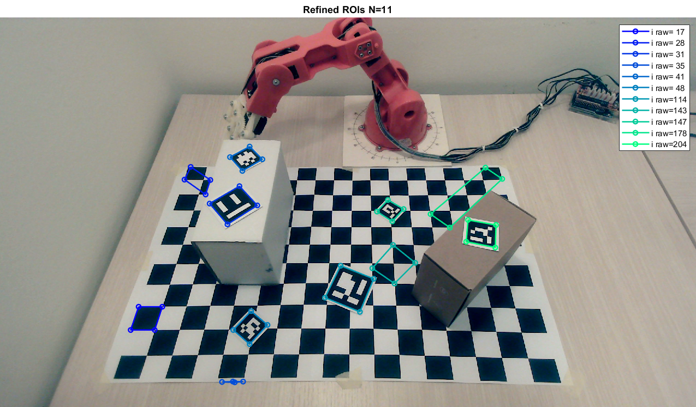
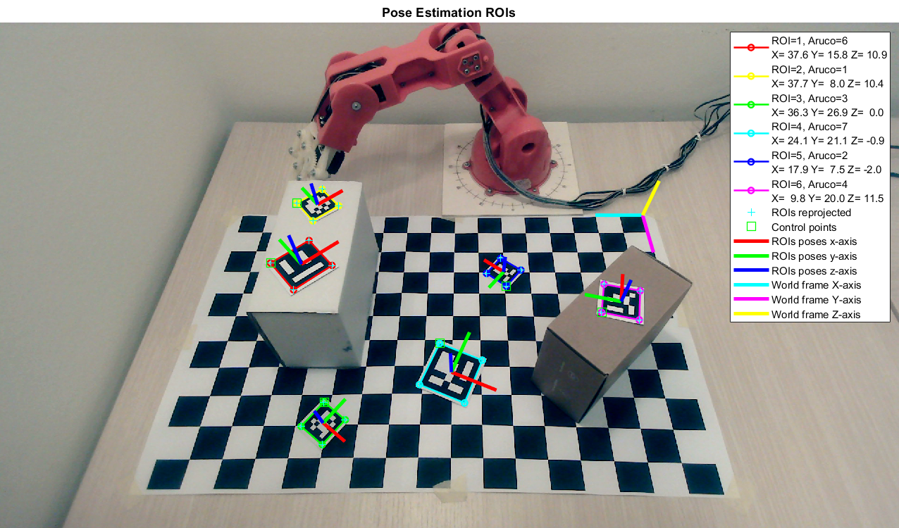
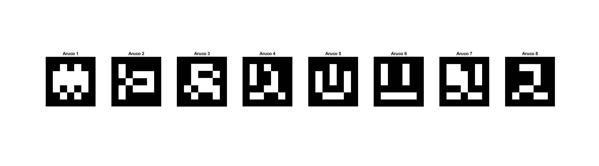

# Roboeye

This project implements a basic hand-eye coordination system between a UVC  camera and the TinkerKit Braccio Robot. It is composed by two main stages. The former is a vision algorithm that detects and estimates the poses of some Aruco Markers in the scene. The latter plans a tracjectory and control the robot in order to reach the positions extimated by the vision stage.  

## Table of Contents
1. [Installation](#installation)
2. [Overview](#overview)
3. [Documentation](#documentation)
4. [Demo](#demo)
5. [Contributors](#contributors)
6. [Credits](#credits)
7. [References](#references)
8. [License](#license)

## Installation
#### Matlab Version
+ Minimum Matlab version >= 2019b
+ Tested with Matlab 2020b

#### Package installation
+ Install [MATLAB Support Package for USB Webcams](https://www.mathworks.com/help/supportpkg/usbwebcams/index.html?s_tid=CRUX_lftnav)
+ Install [Computer Vision Toolkit](http://www.diegm.uniud.it/fusiello/demo/toolkit/)
+ Install [Arduino IDE](https://www.arduino.cc/en/software)

#### Hardware setup
+ Robot used [ThinkerKit Braccio](https://www.arduino.cc/en/Guide/Braccio)
+ Roffie UC20 webcam 1080p

#### Run setup 
1. Go to HOMEDIR / src
2. Run setup.m file

## Overview

### Robot Calibration
The code provides some utilities for camera calibration:
+ Intrinsics calibration via **SMZ** algorithm.
+ Extrinsics calibration wrt a **checkerboard pattern** as world frame.
+ Stereo calibration.

### Robot Vision
The vision stage is composed by a pipeline that spots candidates regions of interest (**ROIs**), matches them with a set Aruco Markers and estimates its pose in space. Namely:
 + The first step extracts the contours from the input image deploying either **Adaptive Thresholding + Moore-Neighbor** or **Canny Edge Detector + Depth First Search** (DFS).
 + The second step selects only the contours with rectangular shapes and refines them in order to identify their corners. To this end, it resorts to either the **Ramer–Douglas-Pecker** algorithm or a **Geometric Corner Extractor**. The output are the ROIs candidated for the matching with the Aruco Markers.
 + The third step removes the perspective distortion of the input ROIs estimating a proper **Homography**. Then, it tries to match them with the Aruco Markers according to the **Hamming Distance 2D**.
 + The last step estimates the poses in space of the matched Aruco Markers through the **Perspective-n-Points** (**PnP**) algorithm.

A calibrated camera is assumeted, i.e., with known intrisics and extrinsics parameters.

### Robot Trajectory Planning
TODO

### Robot Control
TODO

## Documentation
A comprehensive documentation of the code is available in [docs/DOCS.md](./docs/DOCS.md).

## Demo

### Robot Vision
To run an example of pose estimation of Aruco Markers, perform in order the following steps:
1. Retrive the intrisics matrix `K`, the extrinsics `R`, `t` and the radial distortion coefficients `k` of the camera. An example of this procedure can be found [here](./src/scripts/run_calibration_camera.m),
2. Go to HOMEDIR / assets / config_files and create a m-file to set the parameters of the system. An example can be found [here](./assets/config_files/config_pose_estimation.m).
3. Create a set of Aruco Markers to be matched in the scene, as done [here](./src/scripts/create_aruco_markers.m).
4. Acquire from camera or load from the disk an image of the scene.
5. Go to HOMEDIR / src.
6. Launch the Aruco pose estimation as done [here](./src/scripts/run_pose_estimation.m).

Below there are some examples of the results:

The foregoing images has been obtained with the following configuration parameters

    %% CONFIGURATION FILE

    % ROI extraction parameters
    ROI_EXTRACTION_METHOD = 'adaptth-moore'; % adaptth-moore, canny-dfs, canny-dfs-c
    ADAPTTH_SENSITIVITY = 0.7;        % [0,1]
    ADAPTTH_STATISTIC = 'gaussian';   % mean, gaussian, median
    ADAPTTH_NEIGHBORHOOD = [135 241]; % default for 1080x1920 -> [135 241]
    CANNY_TH_LOW  = 0.01;
    CANNY_TH_HIGH = 0.10;

    % ROI refinement parameters
    ROI_REFINEMENT_METHOD = 'geometric'; % rdp, geometric
    ROI_SIZE_TH = 50;
    RDP_TH = 0.2;  % Ramers-Douglas-Peucker threshold
    ROI_SUM_ANGLES_TOL  = 10; % [degrees]
    ROI_PARALLELISM_TOL = 10; % [degrees]
    ROI_SIDE_TH_LOW  = 1/100; % [% diag(img)]
    ROI_SIDE_TH_HIGH = 1/5;   % [% diag(img)]

    % ROI matching parameters
    ROI_BB_PADDING  = 2;
    ROI_H_SIDE = 80;
    ROI_HAMMING_TH  = 2;

    % Debug/Analysis
    
    % 1: show roi_extracted         
    % 2: + show adaptth or canny/dfs 
    ROI_EXTRACTION_VERBOSE        = 1;

    % 1: show roi_refined           
    % 2: + show roi_discarded
    ROI_REFINEMENT_VERBOSE        = 1;

    % 1: show roi_matched/markers   
    % 2: + show H (roi_matched)         
    % 3: + show H (all)
    ROI_MATCHING_VERBOSE          = 1;

    % 1: show roi_pnp               
    % 2: + aruco id/error
    ROI_POSE_ESTIMATION_VERBOSE   = 2;
    
    % 1: detection log
    ARUCO_DETECTION_VERBOSE       = 1;
    
    % 1: pose estimation log
    ARUCO_POSE_ESTIMATION_VERBOSE = 1; 

### Robot Trajectory Planning
TODO

### Robot Control
+ TODO Video

## Contributors
+ [Mattia Balutto](https://github.com/mattiabalutto) - MSc Electronic Engineering, University of Udine (Italy).
+ [Diego Perisutti](https://github.com/DiegoPerissutti) - MSc Mechanical Engineering, University of Udine (Italy).
+ [Claudio Verardo](https://github.com/claudioverardo) - MSc Electronic Engineering, University of Udine (Italy).

Equal contribution from all the contributors.

## Credits
The project has been developed under the supervision of:
+ Professor Andrea Fusiello, University of Udine (Italy).
+ Professor Stefano Miani, University of Udine (Italy).

The implementation of the vision algorithms of the system takes inspiration from the [Computer Vision Toolkit](http://www.diegm.uniud.it/fusiello/demo/toolkit/), [Calibration Toolkit](http://www.diegm.uniud.it/fusiello/demo/toolkit/calibration.html) made by Professor Andrea Fusiello at University of Udine.

Whenever we are missing some credits acknowledgements, please let us know and we will fix them.

## References
TODO - Copiare quelli della relazione

## License
The code is licensed under Creative Commons, check the [LICENSE](./LICENSE) file.
