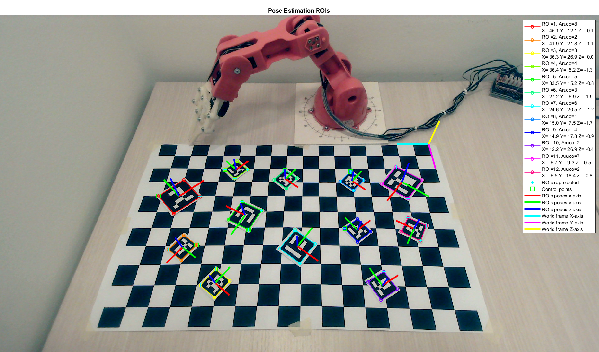

# Roboeye

This project implements a basic hand-eye coordination system between a UVC  camera and the TinkerKit Braccio Robot. It is composed by two main stages. The former is a vision algorithm that detects and estimates the poses of some Aruco Markers in the scene. The latter plans a tracjectory and control the robot in order to reach the positions extimated by the vision stage.  

## Table of Contents
1. [Installation](#installation)
2. [Overview](#overview)
3. [Examples](#examples)
4. [Demo](#demo)
5. [Documentation](#documentation)
6. [Contributors](#contributors)
7. [Credits](#credits)
8. [References](#references)
9. [License](#license)

## Installation
#### Matlab Version
+ Minimum Matlab version >= 2019b
+ Tested with Matlab 2020b

#### Package installation
+ Install [MATLAB Support Package for USB Webcams](https://www.mathworks.com/help/supportpkg/usbwebcams/index.html?s_tid=CRUX_lftnav)
+ Install [Computer Vision Toolkit](http://www.diegm.uniud.it/fusiello/demo/toolkit/)
+ Install [Arduino IDE](https://www.arduino.cc/en/software)

#### Hardware setup
+ Robot used [ThinkerKit Braccio](https://www.arduino.cc/en/Guide/Braccio)

#### Run setup 
1. Go to HOMEDIR / src
2. Run setup.m file

## Overview

### Robot Vision
The vision stage is composed by a pipeline that spots candidates regions of interest (**ROIs**), matches them with a set Aruco Markers and estimates its pose in space. Namely:
 + The first step extracts the contours from the input image deploying either **Adaptive Thresholding + Moore-Neighbor** or **Canny Edge Detector + Depth First Search** (DFS)
 + The second step selects only the contours with rectangular shapes and refines them in order to identify their corners. To this end, it resorts to either **Ramer–Douglas-Pecker** algorithm or **Geometric Corner Extractor**. The output are the ROIs candidated for the matching with the Aruco Markers.
 + The third step remove the prospective distortion of the input ROIs and try to match them with the Aruco Marker in a given dictionary (**Homography** and **Hamming Distance**).
 + The last step estimates the pose of the matched ROIs through the **Perspective-n-Points** (**PnP**).

A calibrated camera is assumeted, i.e., with known intrisics and extrinsics parameters. You can retrive this informations by using the **run_calibration** script

### Robot Control
TODO

## Examples

### Robot Vision
To run an example of pose estimation of Aruco Markers, perform in order the following steps:
1. Go to HOMEDIR / assets / config_files.
2. Set the parameters of the pipeline (in this example we are using the 2nd pipeline, you must enable the verbose setting for plotting).
3. Go to HOMEDIR / src.
4. Run **run_pose_estimation** script.

Below there are some examples of the pipeline:

The foregoing images has been obtained with the following configuration parameters (HOMEDIR / assets / config_files / config_pose_estimation.m)

    %% CONFIGURATION FILE OF ROBOEYE

    % ROI extraction parameters
    ROI_EXTRACTION_METHOD = 'adaptth-moore'; % adaptth-moore, canny-dfs, canny-dfs-c
    ADAPTTH_SENSITIVITY = 0.7;        % [0,1]
    ADAPTTH_STATISTIC = 'gaussian';   % mean, gaussian, median
    ADAPTTH_NEIGHBORHOOD = [135 241]; % default for 1080x1920 -> [135 241]
    CANNY_TH_LOW  = 0.01;
    CANNY_TH_HIGH = 0.10;

    % ROI refinement parameters
    ROI_REFINEMENT_METHOD = 'geometric'; % rdp, geometric
    ROI_SIZE_TH = 50;
    RDP_TH = 0.2;  % Ramer–Douglas–Peucker threshold
    ROI_SUM_ANGLES_TOL  = 10; % [degrees]
    ROI_PARALLELISM_TOL = 10; % [degrees]
    ROI_SIDE_TH_LOW  = 1/100; % [% diag(img)]
    ROI_SIDE_TH_HIGH = 1/5;   % [% diag(img)]

    % ROI matching parameters
    ROI_BB_PADDING  = 2;
    ROI_H_SIDE = 80;
    ROI_HAMMING_TH  = 2;

    ...

### Robot Control
+ TODO

## Demo
TODO Video

## Documentation
Check the associated document [DOCS.md](https://github.com/claudioverardo/roboeye/blob/develop/DOCS.md)

## Contributors
+ [Mattia Balutto](https://github.com/mattiabalutto) - MSc Electronic Engineering, University of Udine (Italy)
+ [Diego Perisutti](https://github.com/DiegoPerissutti) - MSc Mechanical Engineering, University of Udine (Italy)
+ [Claudio Verardo](https://github.com/claudioverardo) - MSc Electronic Engineering, University of Udine (Italy)

Equal contribution from all the contributors

## Credits
The project and the sample images are inspired from the:
+ [Computer Vision Toolkit](http://www.diegm.uniud.it/fusiello/demo/toolkit/) by Professor Andrea Fusiello at University of Udine

Whenever we are missing some credits acknowledgements, please let us know and we will fix it.

## References
TODO - Copiare quelli della relazione

## License
TODO dovrebbe essere MIT da controllare con fusiello