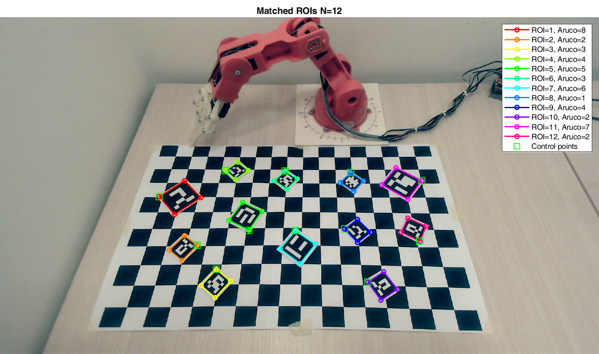

# RoboEye: enable hand-eye coordination with TinkerKit Braccio Robot and  ArUco markers

<!--

-->

Demo video: [https://www.youtube.com/watch?v=Vw66SZN9R2s](https://www.youtube.com/watch?v=Vw66SZN9R2s)

Demo video (robot perspective): [https://www.youtube.com/watch?v=31yvqWvIydo](https://www.youtube.com/watch?v=31yvqWvIydo)

This project implements a basic hand-eye coordination system between a UVC  camera and the TinkerKit Braccio Robot. It is composed by two main modules. The former is a vision pipeline that detects and estimates the poses of the ArUco markers in the scene. The latter is a trajectory planner that solves the inverse kinematics problem in order to reach a desired position of the end effector in space.

A control module allows the user to interactively define some tasks for the robot such as moving to a target or pick and place an object identified by a marker. It automatically invokes the vision and the trajectory planning modules when necessary. Moreover, it sends the control signals and the data required by the low-level controller of the robot (Arduino). A calibration module allows the user to calibrate the intrinsics and extrinsics parameters of the camera.

-CC%20BY--NC--SA-green)

## Table of Contents
1. [Installation](#installation)
2. [Overview](#overview)
3. [Usage examples](#usage-examples)
4. [Documentation](#documentation)
5. [Contributors](#contributors)
6. [Credits](#credits)
7. [License](#license)
8. [References](#references)

## Installation

#### Hardware setup
+ [ThinkerKit Braccio Robot](https://www.arduino.cc/en/Guide/Braccio)
+ [Arduino Uno](https://www.arduino.cc/en/Guide/ArduinoUno)
+ Roffie UC20 webcam 1080p

#### Software requirements
+ [MATLAB](https://www.mathworks.com/products/matlab.html) >= R2019b (tested with R2020b)
+ [MATLAB Support Package for USB Webcams](https://www.mathworks.com/matlabcentral/fileexchange/45182-matlab-support-package-for-usb-webcams)
+ [MATLAB Support for MinGW-w64 C/C++ Compiler](https://www.mathworks.com/matlabcentral/fileexchange/52848-matlab-support-for-mingw-w64-c-c-compiler)
+ [Arduino IDE](https://www.arduino.cc/en/software) (tested with v1.8.13)
+ [Computer Vision Toolkit](http://www.diegm.uniud.it/fusiello/demo/toolkit/) (only if the calibration module is used)

#### Run setup 
1. Go to [/src](./src) and run the setup.m file.
2. Go to [/src/robot_control/arduino_robot_fsm](./src/robot_control/arduino_robot_fsm) and upload the content on Arduino.

## Overview
The code is composed by 4 main modules: vision, trajectory planning, control and calibration.

### Robot Vision
The vision module is composed by a pipeline that spots candidates regions of interest (**ROIs**), matches them with a dictionary of ArUco markers and estimates their poses in space. Namely:
 + The first step extracts the contours from the input image deploying either the **adaptive thresholding + Moore-Neighbor tracing** or the **Canny edge detector + depth-first search (DFS)**.
 + The second step selects only the contours with quadrilateral shapes and refines them in order to identify their corners. To this end, it resorts to either the **Ramer–Douglas–Peucker** algorithm or a **geometric corner extractor**. The output are the ROIs candidated for the matching with the ArUco markers.
 + The third step removes the perspective distortion of the input ROIs estimating a proper **homography transformation**. Then, it looks for matchings with the ArUco markers in the provided dictionary evaluating their **Hamming distances** with the binarized ROIs.
 + The fourth step estimates the poses in space of the matched ArUco markers through the **Perspective-n-Points (PnP)** algorithm and the minimization of the **reprojection error**.

The vision module requires a calibrated camera, i.e., with known intrisics and extrinsics parameters.

### Robot Trajectory Planning
The trajectory planning module deals with the modelling and the planning for the Tinkerkit Braccio Robot, which is a 5 DOF robot with a gripper as end effector. Namely:
+ It computes the **direct kinematics** of the robot using its **Denavit–Hartenberg (DH) parameters**.
+ It solves the problem of **inverse kinematics** for a given position and orientation of the end effector in space. Three different approaches are implemented. The first addresses the full problem aiming to solve the direct kinematics equations wrt the positions of the joints. The second and the third exploit some domain knowledge to reduce the number of joints to be considered in the problem from 5 to 3 and 2 respectively. The latter approaches lead to more stable and computationally efficient routines. 
+ Leveraging the solutions of the inverse kinematics, it allows to retrieve **keypoints** and **elemental trajectories** in the joints space from specifications of the end effector poses. They can be used as building blocks for more complex trajectories defined by keypoints or point-by-point.
+ Studying the **geometric Jacobian** of the robot, it identifies the **singularities** among the joints positions.

### Robot Control
The control module provides the low-level controller of the robot and its high-level interface. Namely:

+ A **finite-state-machine (FSM)** that runs on Arduino and control the robot behavior through 10 different states and their control signals/data received from the serial.
+ A **Matlab interface** with the Arduino FSM through the serial connection. It keeps track of the FSM transitions and allows the user to send control signals and data from the Matlab command window.
+ Within the Matlab interface, a **trajectory generator** tool is available. It allows the user to interactively define some basic tasks such as pick-and-place objects or move to targets identified by ArUco markers. The interaction with the vision and trajectory planning modules is handled by the interface itself.

### Robot Calibration
The calibration module provides some utilities to calibrate the camera used by the vision module:
+ Intrinsics calibration via the **Sturm-Maybank-Zhang (SMZ)** algorithm.
+ Extrinsics calibration wrt a **checkerboard pattern** as world frame via the PnP algorithm.

## Usage examples
To reproduce the following usage examples please refer to the scripts and the example data provided in the folders [src/scripts](./src/scripts) and [assets](./assets) respectively. **NOTE: all the scripts must be executed from the folder [/src](./src).**

### Robot Vision
To run an example of pose estimation of ArUco markers, perform in order the following steps:
1. Retrive the intrisics matrix `K`, the extrinsics `R`, `t` and the radial distortion coefficients `k` of the camera. For a new camera the calibration module can be used (cf. the related usage example). To use the test images provided with the repo (cf. point 4), the related camera parameters are available in [/assets/calibration](./assets/calibration).
2. Create a m-file to set the parameters of the vision pipeline. An example containing the default parameters of the pipeline is [/assets/config_files/config_pose_estimation.m](./assets/config_files/config_pose_estimation.m). 
3. Create the dictionary of ArUco markers to be matched in the scene, as done in [create_aruco_markers.m](./src/scripts/create_aruco_markers.m). Some examples of dictionaries are available in [/assets/aruco_markers](./assets/aruco_markers).
4. Acquire from the camera or load from the disk an image of the scene. Some test images are available in [/assets/img_tests](./assets/img_tests) for both the example dictionaries of ArUco 7x7 and 8x8. 
5. Launch the ArUco pose estimation by calling [aruco_pose_estimation.m](./src/robot_vision/aruco_pose_estimation.m).

To run the above steps on the test data provided with the repo you can launch the script [run_pose_estimation.m](./src/scripts/run_pose_estimation.m). The following images shows the results obtained for all the stages of the vision pipeline.

<!-- alternative vision demo

-->

### Robot Control

To run the Matlab interface with the Arduino FSM, perform in order the following steps:

1. If you want to perform grasping experiments, create a dictionary with the grasping parameters of the objects as done in [create_objects_dict.m](./src/scripts/create_objects_dict.m). Some examples of dictionaries are available in [/assets/objects_dict](./assets/objects_dict). Note that the program assumes a 1-to-1 correspondence between objects and ArUco markers.
2. Create a m-file to set the parameters and data needed by the vision and trajectory planning modules. An example containing the parameters used in the demo videos is [/assets/config_files/config_robot.m](./assets/config_files/config_robot.m). 
3. Connect the Arduino controller via USB and retrieve the name of the port and the baud rate. Check also that the power supplier is connected to the power shield that supplies the servo motors of the robot.
4. Launch the Matlab interface with the Arduino FSM by calling [robot_fsm_interface.m](./src/robot_control/m-files/robot_fsm_interface.m).

To run the above steps with the data you can launch the script [run_pose_estimation.m](./src/scripts/run_pose_estimation.m). The following videos show an example of pick-and-place task performed via the Matlab interface (a little extra to the introduction demo :wink:). The commands are automatically fed into the command window by a previously filled buffer.

First video: [https://www.youtube.com/watch?v=Kzpq9sqbxM0](https://www.youtube.com/watch?v=Kzpq9sqbxM0).

Second video (robot perspective): [https://www.youtube.com/watch?v=rr2VxXzEknk](https://www.youtube.com/watch?v=rr2VxXzEknk).

<!--
On the left there are the log messages of the Matlab-Arduino interfaces. On the right there is the footage of the scene as recorded by the camera of vision module.
--> 

### Robot Calibration

To run the calibration of the intrinsics parameters of the camera:

1. Print a checkerboard pattern as [/assets/calibration/checkerboard.pdf](./assets/calibration/checkerboard.pdf).
2. Acquire some images of it from the camera by calling [acquire_calibration_images.m](./src/robot_calibration/acquire_calibration_images.m).
3. Run the SMZ calibration with [calibration_intrinsics_camera.m](./src/robot_calibration/calibration_intrinsics_camera.m). It will ask to acquire 4 control points from each image, as shown in the file [/assets/calibration/control-points.pdf](./assets/calibration/control-points.pdf).

The following image shows the final results obtained with the camera used in all our experiments, whose calibration files are in [/assets/calibration/intrinsics_cam1](./assets/calibration/intrinsics_cam1).

To run the calibration of the extrinsics parameters of the camera:

1. Retrieve the camera intrinsics as described above.
2. Print a checkerboard pattern and be sure that it is completely in the field of view of the camera.
3. Run the PnP calibration with [calibration_extrinsics_camera.m](./src/robot_calibration/calibration_extrinsics_camera.m). It will ask to acquire the 4 control points from the checkerboard as done in the intrinsics calibration. The first 2 ponts will define the X-axis of the world frame while the last 2 points will define the Y-axis.

The following image shows the final results obtained with the setup used to acquire the test images in [/assets/img_tests/7x7](./assets/img_tests/7x7), whose calibration files are in [/assets/calibration/extrinsics_cam1_tests_7x7](./assets/calibration/extrinsics_cam1_tests_7x7).

To run the above steps for intrinsics and etrinsics calibration you can use the script [run_calibration_camera.m](./src/scripts/run_calibration_camera.m).

## Documentation
A comprehensive documentation of the code is available in [docs/DOCS.md](./docs/DOCS.md).

## Contributors
All the following contributors have equally contributed to the development of the project:

+ [Mattia Balutto](https://github.com/mattiabalutto) - MSc Electronic Engineering, University of Udine, Italy.
+ [Diego Perisutti](https://github.com/DiegoPerissutti) - MSc Mechanical Engineering, University of Udine, Italy.
+ [Claudio Verardo](https://github.com/claudioverardo) - MSc Electronic Engineering, University of Udine, Italy.

## Credits
The project has been developed under the supervision of:
+ Professor Andrea Fusiello, University of Udine, Italy.
+ Professor Stefano Miani, University of Udine, Italy.

<!--
The implementation of the vision algorithms of the system takes inspiration from the [Computer Vision Toolkit](http://www.diegm.uniud.it/fusiello/demo/toolkit/), [Calibration Toolkit](http://www.diegm.uniud.it/fusiello/demo/toolkit/calibration.html) made by Professor Andrea Fusiello at University of Udine.
-->

In case we were missing some credits acknowledgements, please let us know and we will add them.

## License
Wherever not differently specified, the code is licensed under MIT License as described in the [LICENSE](./LICENSE) file. The only exception is the content of [/src/thirdparty](/src/thirdparty), which is adapted from the [Calibration Toolkit](http://www.diegm.uniud.it/fusiello/demo/toolkit/calibration.html) by Andrea Fusiello and is licensed under CC BY-NC-SA as described in the [LICENSE.thirdparty](./LICENSE.thirdparty) file.

## References
[1] J. Canny, "A Computational Approach to Edge Detection," in IEEE Transactions on Pattern Analysis and Machine Intelligence, vol. PAMI-8, no. 6, pp. 679-698, Nov. 1986.

[2] P. Corke. 2013. Robotics, Vision and Control: Fundamental Algorithms in MATLAB (1st. ed.). Springer Publishing Company, Incorporated.

[3] S. Garrido-Jurado, R. Muñoz-Salinas, F.J. Madrid-Cuevas, M.J. Marín-Jiménez, Automatic generation and detection of highly reliable fiducial markers under occlusion, Pattern Recognition, Volume 47, Issue 6, 2014, Pages 2280-2292, ISSN 0031-3203.

[4] R. Hartley and A. Zisserman. 2003. Multiple View Geometry in Computer Vision (2nd. ed.). Cambridge University Press, USA.

[5] N. Otsu, "A Threshold Selection Method from Gray-Level Histograms," in IEEE Transactions on Systems, Man, and Cybernetics, vol. 9, no. 1, pp. 62-66, Jan. 1979.

[6] B. Siciliano, L. Sciavicco, L. Villani, and G. Oriolo. 2010. Robotics: Modelling, Planning and Control. Springer Publishing Company, Incorporated.

[7] P. F. Sturm and S. J. Maybank, "On plane-based camera calibration: A general algorithm, singularities, applications," Proceedings. 1999 IEEE Computer Society Conference on Computer Vision and Pattern Recognition (Cat. No PR00149), Fort Collins, CO, USA, 1999, pp. 432-437 Vol. 1.

[8] R. Szeliski. 2010. Computer Vision: Algorithms and Applications (1st. ed.). Springer-Verlag, Berlin, Heidelberg.

[9] T. H. Cormen, C. E. Leiserson, R. L. Rivest, and C. Stein. 2009. Introduction to Algorithms, Third Edition (3rd. ed.). The MIT Press.

[10] Z. Zhang, "A flexible new technique for camera calibration," in IEEE Transactions on Pattern Analysis and Machine Intelligence, vol. 22, no. 11, pp. 1330-1334, Nov. 2000.
