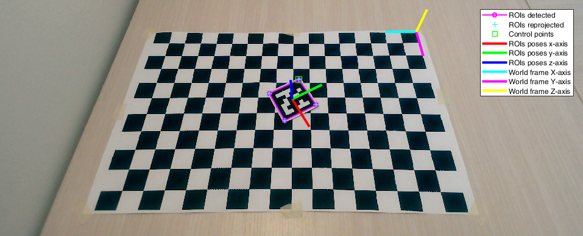
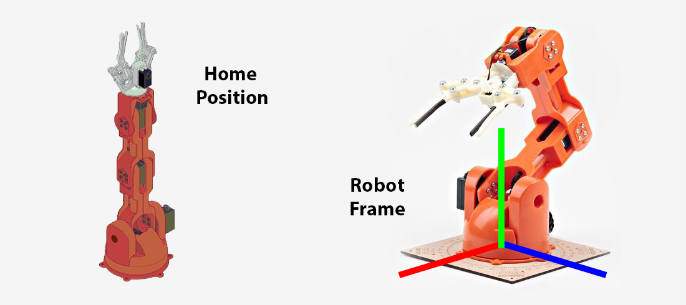
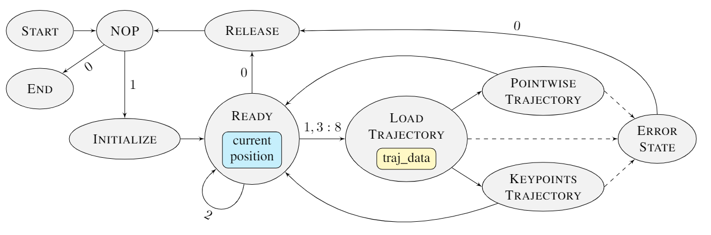

# Documentation

1. [Robot Vision](#robot-vision)
2. [Robot Trajectory Planning](#robot-trajectory-planning)
3. [Robot Control](#robot-control)
4. [Robot Calibration](#robot-calibration)

## Robot Vision

Code to perform the detection and the pose estimation of Aruco markers in the scene. Usage examples can be found in [run_detection](../src/scripts/run_detection.m) and [run_pose_estimation](../src/scripts/run_pose_estimation.m).

These functions assume the Matlab conventions to represent the pinhole model of a camera (in the following, **Matlab convention**). Namely, points on the image plane `m` and in space `M` are represented by row vectors. The projection equation takes the form `m = M*P = M*[R; t]*P`, where `P, K, R, t` are the transposes of their counterparts in the literature convention (cf. [Robot Calibration](#robot-calibration)).

We refer to **world frame** (or **vision frame**) as the coordinate system XYZ wrt the camera extrinsics are calibrated (magenta-cyan-yellow axes in the image below). We refer to **ROI frame** (also, ROI pose) as the coordinate system xyz placed at the center of a marker such that its contol points is at `(-0.5,0.5,0)*side`, where `side` is the real length of the marker side (red-blue-green axes in the image below).

### Matlab functions

<!-- aruco_detection matlab function -->

    

        aruco_detection
    

Build the Aruco detection pipeline. It executes in order the functions roi_extraction(...), roi_refinement(...), roi_matching(...).

    [rois_matched, i_arucos, stats] = aruco_detection(img, aruco_markers, varargin)

Input arguments:
+ **img**: input image
+ **ruco_markers**: markers to be matched
+ **varargin**: collection of optional parameters, cf. the official Matlab documentation

Parameters:
+ **'verbose'**: verbose level of the function (0, 1)
    + 0: show nothing
    + 1: show log in the command window
+ Refer to roi_extraction(...), roi_refinement(...), roi_matching(...) for details about further allowed parameters.

Output arguments:
+ **rois_matched**: ROIs matched with the markers
+ **i_arucos**: indices of the markers matched with the rois_matched
+ **stats**: struct with some performance statistics
    + number of ROIs extracted/refined
    + times of ROIs extraction/refinement/matching

<!-- aruco_pose_estimation matlab function -->

    

        aruco_pose_estimation
    

Build the Aruco pose estimation pipeline. It executes in order the functions aruco_detection(...), roi_pose_estimation(...).

    [rois, i_arucos, rois_R, rois_t] = aruco_pose_estimation(img, aruco_markers, aruco_real_sides, K, R_cam, t_cam, k, varargin)

Input arguments:
+ **img**:                input image
+ **aruco_markers**:      markers to be matched
+ **aruco_real_sides**:   real world lengths of the sides of the markers [cm]
+ **K**:                  intrisics matrix of the camera (Matlab convention)
+ **R_cam**:              rotation matrix of the camera extrinsics in the world frame (Matlab convention)
+ **t_cam**:              translation vector of the camera extrinsics in the world frame (Matlab convention)
+ **k**:                  radial distortion coefficients of the camera
+ **varargin**:           collection of optional parameters, cf. the official Matlab documentation

Parameters:
+ **'verbose'**: verbose level of the function (0, 1)
    + 0: show nothing
    + 1: show log in the command window
+ Refer to aruco_detection(...), roi_pose_estimation(...) for details about further allowed parameters

Output arguments:
+ **rois**:               ROIs matched with the markers
+ **i_arucos**:           indices of the markers matched with the rois
+ **rois_R**:             rotation matrices of the roto-translations that map points from the ROIs frames into the world frame (Matlab convention)
+ **rois_t**:             translation vectors of the roto-translations that map points from the ROIs frames into the world frame (Matlab convention)
+ **stats**:              struct with some performance statistics
    + number of ROIs extracted/refined
    + times of ROIs extraction/refinement/matching and pose estimation    
    + reprojection errors of lin/nonlin PnP

<!-- check_boundaries matlab function -->

    

        check_boundaries
    

Return 1 if the point (i, j) in pixel coordinates is inside an image, whose size is defined by img_size.

    check_ans = check_boundaries(i, j, img_size)

Input arguments:
+ **i**:          i point coordinate (row)
+ **j**:          j point coordinate (column)
+ **img_size**:   1x2 [rows img limit, columns img limit]

Output arguments:
+ **check_ans**:  1 if the point is inside the image 0 otherwise

<!-- check_quadrilateral matlab function -->

    

        check_quadrilateral
    

Check if the set of input points defines the shape of a valid quadrilateral, i.e., it is close to the shape of a parallelogram.

    is_valid_quad = check_quadrilateral(points, varargin)

Input arguments:
+ **points**:   array Nx2 of points that defines the shape [ [x1,y1]; [x2,y2]; ... ; [xN,yN] ]
+ **varargin**: collection of optional parameters, cf. the official Matlab documentation

Parameters:
+ **'sum_angles_tol'**: tolerance on the sum of the internal angles [degrees]
+ **'parallelism_tol'**: tolerance on the angle between opposite sides [degrees]
+ **'side_th_low'**: lower threshold on the length of each side [pixels]
+ **'side_th_high'**: higher threshold on the length of each side [pixels]
+ **'angle_th_low'**: lower threshold on the internal angles [degrees]
+ **'angle_th_high'**: higher threshold on the internal angles [degrees]

Output arguments:
+ **is_valid_quad**: 1 if the shape is a valid quadrilateral 0 otherwise

NOTE: a shape is discarded when one of the following conditions is met:
+ sum of the internal angles > 360° + sum_angles_tol 
+ angle between opposide sides > parallelism_tol
+ length of a side < side_th_low
+ length of a side > side_th_high
+ value of an internal < angle_th_low
+ value of an internal > angle_th_high

<!-- get_image matlab function -->

    

        get_image
    

Acquire an image from camera or load an image from disk.

    img = get_image(img_source)

Input arguments:
+ **img_source**: webcam object or path to an image on disk

Output arguments:
+ **img**: image acquired from the camera or loaded from disk

<!-- hom_tf matlab function -->

    

        hom_tf
    

Apply the homogeneous transformation H to the set of points X. The points are arranged by rows X = [x1; ... ; xN] and Y = [y1; ... ; yN]. The transformation acts on the homogeneous coordinates, hom(Y) = hom(X)*H. If required, apply also radial distortion to the results.

    Y = hom_tf(X, H)

    Y = hom_tf(X, H, K, k)

Input arguments:
+ **X**: input set of points (inhomogeneous coordinates)
+ **H**: transformation between homogeneous coordinates (Matlab convention)
    + H 4x3 is a projection 
    + H 3x3 is a transformation in the projective plane
    + H 4x4 is a transformation in the projective space
+ **K**: intrisics matrix of the camera (optional)
+ **k**:  radial distortion coefficients of the camera (optional)

Output arguments:
+ **Y**: transformed set of points (inhomogeneous coordinates)

NOTE: if intrinsics K and radial distortion coefficients k are provided, the points Y must be 2D image points.

<!-- plot_aruco_markers matlab function -->

    

        plot_aruco_markers
    

Show the content of a set of Aruco markers.

    plot_aruco_markers(aruco_markers)

Input arguments:
+ **aruco_markers**: cell array containing the Aruco markers

<!-- pnp_lin matlab function -->

    

        pnp_lin
    

Perspective-n-Points (PnP) from 3D-2D correspondences. It finds the camera extrinsics R, t wrt the frame of the 3D points from a set of 3D-2D correspondences. The algorithm assumes coplanar 3D points, i.e. with z=0. Also the RMS value of the reprojection errors is returned.

    [R, t, reproj_err] = pnp_lin(X_image, X_world, K)
    
Input arguments:
+ **X_image**:    Nx2 array, 2D image points
+ **X_world**:    Nx3 array, 3D world points ( X_world(:,3) = 0 )
+ **K**:          intrisics matrix of the camera

Output arguments:
+ **R**:          rotation matrix of the camera extrinsics
+ **t**:          translation vector of the camera extrinsics
+ **reproj_err**: reprojection error (RMS value)

NOTE: Matlab convention is assumed, `X_image = X_world*[R; t]*K`.

<!-- pnp_nonlin matlab function -->

    

        pnp_nonlin
    

Non-linear refinement of Perspective-n-Points (PnP) from 3D-2D correspondences. It iterativelly refines the input camera extrinsics through inimization of the reprojection errors of a set of 3D-2D correspondences. Also the RMS value of the final reprojection errors is returned.

    [R, t, reproj_err] = pnp_nonlin(R0, t0, X_image, X_world, K, k)

Input arguments:
+ **R0**:         initial guess for the rotation matrix of the camera extrinsics, e.g., calculated with pnp_lin(...)
+ **t0**:         initial guess for the translation vector of the camera extrinsics, e.g., calculated with pnp_lin(...)
+ **X_image**:    Nx2 array, 2D image points
+ **X_world**:    Nx3 array, 3D world points
+ **K**:          intrisics matrix of the camera
+ **k**:          radial distortion coefficients of the camera

Output arguments:
+ **R**:          rotation matrix of the (refined) camera extrinsics
+ **t**:          translation vector of the (refined) camera extrinsics
+ **reproj_err**: reprojection error (RMS value)

NOTE: Matlab convention is assumed, `X_image = fd( X_world*[R; t]*K)` where `fd` is the function that applies the radial distortion.

<!-- rad_dist_apply matlab function -->

    

        rad_dist_apply
    

Return the distorted pixel coordinates from the true ones.

    [m_d, J_m] = rad_dist_apply(m, K, k)

Input arguments:
+ **m**:      Nx2 array, undistorted image points
+ **K**:      intrisics matrix of the camera (Matlab convention)
+ **k**:      radial distortion coefficients of the camera

Output arguments:
+ **m_d**:    Nx2 array, distorted image points
+ **J_m**:    cell array of Jacobians of m_d wrt m (2x2 matrices)

<!-- rad_dist_remove matlab function -->

    

        rad_dist_remove
    

Return the true pixel coordinates from the distorted ones (solving a non-linear iterative LS problem).

    [m, err] = rad_dist_remove(m_d, K, k)

Input arguments:
+ **m_d**:    Nx2 array, distorted image points
+ **K**:      intrisics matrix of the camera (Matlab convention)
+ **k**:      radial distortion coefficients of the camera

Output arguments:
+ **m**:      Nx2 array, undistorted image points
+ **err**:    final error of the iterative solver (RMS value)

<!-- reprojection_error matlab function -->

    

        reprojection_error
    

Reprojection error of a 3D-2D correspondence. It finds the component-wise reprojection error between a 2D point and a 3D point. The Jacobian wrt the extrinsics of the camera is also returned.

    [err, J_ext] = reprojection_error(m, M, K, R, t, k)

Input arguments:
+ **m**:      Nx2 array, 2D image points
+ **M**:      Nx3 array, 3D world points
+ **K**:      intrisics matrix of the camera
+ **R**:      rotation matrix of the camera extrinsics
+ **t**:      translation vector of the camera extrinsics
+ **k**:      radial distortion coefficients of the camera

Output arguments:
+ **err**:    2Nx1 array, reprojection error between `m` and `reproj(M)`
+ **J_ext**:  2Nx12 array, Jacobian of err wrt the camera extrinsics `[R11,R21,R31,R12,R22,R32,R13,R23,R33,t1,t2,t3]`

NOTE: Matlab convention is assumed, `reproj(M) = fd( M*[R; t]*K )` where `fd` is the function that applies the radial distortion.

<!-- roi_extraction matlab function -->

    

        roi_extraction
    

Extract ROIs from the input image.

    [rois_raw, time] = roi_extraction(img, img_gray, varargin)

Input arguments:
+ **img**:      input image
+ **img_gray**: input image (grayscale)
+ **varargin**: collection of optional parameters, cf. the official Matlab documentation

Parameters:
+ **'method'**: choose the ROI extraction algorithm
    + 'adaptth-moore': adaptive thresholding + Moore-Neighbor tracing 
    + 'canny-dfs': Canny edge detector + DFS
    + 'canny-dfs-c': Canny edge detector + DFS C-implementation   
+ **'adaptth_sensitivity'**: sensitivity of the adaptive thresholding, cf. adaptthresh(...)
+ **'adaptth_statistic'**:	statistic of the adaptive thresholding, cf. adaptthresh(...)		
+ **'adaptth_neighborhood'**:	neighborhood size of the adaptive thresholding, cf. adaptthresh(...)			
+ **'canny_th_low'**: lower threshold of the Canny edge detector, cf. edge(...)
+ **'canny_th_high'**: higher threshold of the Canny edge detector, cf. edge(...)		
+ **'verbose'**: verbose level of the function (0, 1, 2)
    + 0: show nothing
    + 1: show the extracted ROIs
    + 2: show also the binarized image (if 'adaptth-moore') or the Canny+DFS output (if 'canny-dfs')

Output arguments:
+ **rois_raw**: extracted ROIs without any refinement
+ **time**: execution time (ignoring plots)

<!-- roi_extraction_dfs matlab function -->

    

        roi_extraction_dfs
    

Apply the depth-first search (DFS) algorithm to a picture filtered with the Canny edge detector (2D-Graph) and extract the connected components from it (set of points, set of tails).

    components = roi_extraction_dfs(img_canny)

Input arguments:
+ **img_canny**: input image filtered by Canny edge detector

Output arguments:
+ **components**: cell array of the connected components (points and tails)
    + components{i,1} is the set of points of the i-th component
    + components{i,2} is the set of tails of the i-th component

<!-- roi_matching matlab function -->

    

        roi_matching
    

Match the Aruco markers with the candidate ROIs.

    [rois_matched, i_rois_matched, i_arucos, time] = roi_matching(img, img_gray, rois_refined, i_rois_refined, aruco_markers, varargin)

Input arguments:
+ **img**: input image
+ **img_gray**: input image (grayscale)
+ **rois_refined**: candidated ROIs for matching with markers
+ **i_rois_refined**: indices of the rois_refined in the rois_raw cell array
+ **aruco_markers**: markers to be matched
+ **varargin**: collection of optional parameters, cf. the official Matlab documentation

Parameters:
+ **'roi_bb_padding'**: padding value of bounding boxes [pixels]
+ **'roi_h_side'**: side value of a ROI after homography [pixels]
+ **'roi_hamming_th'**: maximum value of hamming distance to detect a marker
+ **'verbose'**: verbose level of the function (0, 1, 2, 3)
    + 0: show nothing
    + 1: show the matched ROIs and the markers IDs
    + 2: show also the homographies of the matched ROIs
    + 3: show also the homographies of the unmatched ROIs

Output arguments:
+ **rois_matched**: matched ROIs among the candidated ROIs
+ **i_rois_matched**: indices of the rois_matched in the rois cell array
+ **i_arucos**: indices of the markers matched with the rois_matched
+ **time**: execution time (ignoring plots)

<!-- roi_pose_estimation matlab function -->

    

        roi_pose_estimation
    

Compute the poses of the matched ROIs in the world frame.

    [R, t, err_lin, err_nonlin, time] = roi_pose_estimation(img, rois, i_arucos, aruco_real_sides, K, R_cam, t_cam, k, varargin)

Input arguments:
+ **img**: input image
+ **rois**: ROIs matched with the markers
+ **i_arucos**: indices of the matched markers for every ROIs
+ **aruco_real_sides**: real world lengths of the sides of the markers [cm]
+ **K**: intrisics matrix of the camera (Matlab convention)
+ **R_cam**: rotation matrix of the camera extrinsics in the world frame (Matlab convention)
+ **t_cam**: translation vector of the camera extrinsics in the world frame (Matlab convention)
+ **k**: radial distortion coefficients of the camera
+ **varargin**: collection of optional parameters, cf. the official Matlab documentation

Parameters:
+ **'verbose'**: verbose level of the function (0, 1, 2)
    + 0: show nothing
    + 1: show the poses of the ROIs
    + 2: show also markers the IDs

Output arguments:
+ **R**: rotation matrices of the roto-translations that map points from the ROIs frames into the world frame (Matlab convention)
+ **t**: translation vectors of the roto-translations that map points from the ROIs frames into the world frame (Matlab convention)
+ **err_lin**: RMS values of reprojection errors (after linear PnP)
+ **err_nonlin**: RMS values of reprojection errors (after non-linear PnP)
+ **time**: execution time (ignoring plots)

<!-- roi_refinement matlab function -->

    

        roi_refinement
    

Refine and select the candidate ROIs for matching.

    [rois_refined, i_rois_refined, time] = roi_refinement(img, rois_raw, varargin)

Input arguments:
+ **img**: input image
+ **rois_raw**: input ROIs without any refinement
+ **varargin**: collection of optional parameters, cf. the official Matlab documentation

Parameters:
+ **'method'**: choose the ROI refinement algorithm
    + 'rdp': Ramer-Douglas–Peucker 
    + 'geometric': find the four extreme corners
+ **'roi_size_th'**: min #points required by each ROI to be processed
+ **'rdp_th'**: threshold of the Ramer-Douglas–Peucker algorithm, cf. reducepoly(...)
+ **'roi_sum_angles_tol'**: tolerance on the sum of the internal angles, cf. check_quadrilateral(...)
+ **'roi_parallelism_tol'**: tolerance on the angle between opposite sides, cf. check_quadrilateral(...)
+ **'roi_side_th_low'**: lower threshold on the length of each side normalized wrt the diagonal of the input image, cf. check_quadrilateral(...)
+ **'roi_side_th_high'**: higher threshold on the length of each side normalized wrt the diagonal of the input image, cf. check_quadrilateral(...)
+ **'roi_angle_th_low'**: lower threshold on the internal angles, cf. check_quadrilateral(...)
+ **'roi_angle_th_high'**: higher threshold on the internal angles, cf. check_quadrilateral(...)
+ **'verbose'**: verbose level of the function (0, 1, 2)
    + 0: show nothing
    + 1: show the refined ROIs
    + 2: show also the discarded ROIs

Output arguments:
+ **rois_refined**: refined and selected ROIs among the input ROIs
+ **i_rois_refined**: indices of the rois_refined in the rois_raw cell array
+ **time**: execution time (ignoring plots)

NOTE: to use Ramer-Douglas–Peucker ('rdp') Matlab >= 2019b is needed.

<!-- rpy2rot matlab function -->

    

        rpy2rot
    

Create a rotation matrix from its roll-pitch-yaw parameterization.

    [R, J_roll, J_pitch, J_yaw] = rpy2rot(a)

Input arguments:
+ **a**: [roll pitch yaw] aka XYZ parameterization of the rotation
    + a(1) = roll, rotation angle around x-axis
    + a(2) = pitch, rotation angle around y-axis
    + a(3) = yaw, rotation angle around z-axis

Output arguments:
+ **R**: rotation matrix, `R = Rx(roll)*Ry(pitch)*Rz(yaw)`
+ **J_roll**: Jacobian of R wrt roll
+ **J_pitch**: Jacobian of R wrt pitch
+ **J_yaw**: Jacobian of R wrt yaw

## Robot Trajectory Planning

Code to perform direct kinematics, inverse kinematics, trajectory planning and check of singularities.

These functions internally assumes a convention (in the following, **model convention**) for the positions of the joints, such that when the robot is in home position all the joints are at their zero position (cf. image below, left). This convention differs from the actual one used by the low level controller (in the following, **robot convention**). The routines invokes for the trajectory planning already perform the conversion from the model to the robot convention before returning the positions of the robot in the space of joints.

The position and orientation of the end effector must be defined in the **robot frame** (cf. image below, right). Therefore, a proper transformation function must be provided in order to deal with poses defined in the vision frame.

### Matlab functions

<!-- braccio_angles matlab function -->

    

        braccio_angles
    

Convert angles from model convention to robot convention.

    out = braccio_angles(in, post_corr, AHposition, THposition)

Input arguments:
+ **out**: NxQNUM-1 array, joints positions in model convention
+ **post_corr**: 1xQNUM-1 array, offsets to be applied a posteriori
+ **AHposition**: 1xQNUM-1 array, actual home position of Braccio
+ **THposition**: 1xQNUM-1 array, theoretical home position of Braccio

Output arguments:
+ **in**: NxQNUM-1 array, joints positions in robot convention

      

<!-- braccio_angles_inv matlab function -->

    

        braccio_angles_inv
    

Convert angles from robot convention to model convention.

    in = braccio_angles_inv(out, post_corr, AHposition, THposition)

Input arguments:
+ **out**: NxQNUM-1 array, joints positions in robot convention
+ **post_corr**: 1xQNUM-1 array, offsets to be applied a posteriori
+ **AHposition**: 1xQNUM-1 array, actual home position of Braccio
+ **THposition**: 1xQNUM-1 array, theoretical home position of Braccio

Output arguments:
+ **in**: NxQNUM-1 array, joints positions in model convention

<!-- check_limits_joints matlab function -->

    

        check_limits_joints
    

Check if a given position in the joints space satisfy the constraints of the Braccio robot.

    check_ans = check_limits_joints(qrob)

Input arguments:
+ **qrob**: 1xQNUM array, joints position under test

Output arguments:
+ **check_ans**: 1 if qrob satisfy the constraints, 0 otherwise

<!-- check_sing matlab function -->

    

        check_sing
    

Check if there are singular configuration among a given set of points in the space of joints (in model convention).

    [sing_flag, sing_vec] = check_sing(Q, braccio_params)

+ **Q**: NxQNUM-1 array, set of joints positions under test
+ **braccio_params**: 1xQNUM-1 array, real parameters of the Braccio robot, cf. direct_kin(...)

Output arguments:
+ **sing_flag**: 1 if at least one singularity is found, 0 otherwise
+ **sing_vec**: sing_vec(i) = 1 if Q(i,:) is singular, 0 otherwise

<!-- denavit_harternberg matlab function -->

    

        denavit_harternberg
    

Find the rototranslation between two reference frames using the Denavit-Hartenberg (DH) parameters.

    A = denavit_harternberg(theta, d, alpha, a)

Input arguments:
+ **theta**: DH parameter 'theta'
+ **d**: DH parameter 'd'
+ **alpha**: DH parameter 'alpha'
+ **a**: DH parameter 'a' (also known as 'r')

Output arguments:
+ **A**: 4x4 roto-translation defined by the DH parameters

<!-- direct_kin matlab function -->

    

        direct_kin
    

Compute the direct kinematics of the Braccio robot for a given joints position and a set of real parameters of the robot. With `njoints=QNUM-1` the direct kinematics for all the joints is computed. With `njoints<QNUM-1` the direct kinematics of only the first njoints is computed.

    Atot = direct_kin(q, njoints, braccio_params)

Input arguments:
+ **q**: 1xQNUM-1 array, joints position in model convention
+ **njoints**: number of joints to be considered for direct kinematics
+ **braccio_params**: 1xQNUM-1 array, real parameters of the Braccio robot
    + (1) = distance between ground and joint 1
    + (2) = distance between joint 1 and joint 2
    + (3) = distance between joint 2 and joint 3
    + (4) = distance between joint 3 and EF tip
    + (5) = 'a' (aka 'r') DH parameter for joint 5

Output arguments:
+ **Atot**: rototranslation matrix of direct kinematics

<!-- dualsol matlab function -->

    

        dualsol
    

For a given joints position in model convention, find the other one that preserves the end effector position and orientation ('dual position').

    qlocdual = dualsol(qloc)

Input arguments:
+ **qloc**: 1xQNUM-1 array, input joints position

Output arguments:
+ **qlocdual**: 1xQNUM-1 array, dual position of qloc

<!-- emulate_keypoints_trajectory matlab function -->

    

        emulate_keypoints_trajectory
    

Given a trajectory defined via keypoints return the actual trajectory followed by the robot. The actual trajectory is interpolated by the microcontroller with braccioServoMovement(...).

    [trajectory_robot, key_idcs] = emulate_keypoints_trajectory(start, trajectory)

Input arguments:
+ **start**: 1xQNUM array, starting point of the trajectory
+ **trajectory**: NxQNUM array, trajectory defined by keypoints

Output arguments:
+ **trajectory_robot**: MxQNUM array, interpolated trajectory (M>=N)
+ **key_idcs**: 1xN array, cointains index where trajectory_robot reaches the keypoints

<!-- estimate_time_trajectory matlab function -->

    

        estimate_time_trajectory
    

Estimate the time to execute a trajectory on the robot.

    time = estimate_time_trajectory(type_trajectory, trajectory, current_q, delta_t)

Input arguments:
+ **type_trajectory**: type of trajectory, cf. generate_trajectory(...)
    + 'pointwise': trajectory defined point by point
    + 'keypoints': trajectory defined via keypoints to be interpolated
+ **trajectory**: NxQNUM array, points of the trajectory
+ **current_q**: 1xQNUM array, current position of the robot (joints)
+ **delta_t**: timestep of the trajectory execution

Output arguments:
+ **time**: estimated execution time of the trajectory

<!-- fix_target_q matlab function -->

    

        fix_target_q
    

Add a small overshoot to the trajectory of the first joint during the movement to a target position.

    target_q_fix = fix_target_q(target_q, current_q, last_q)

Input arguments:
+ **target_q**: 1xQNUM array, target position in joints space
+ **current_q**: 1xQNUM array, current position in joints space
+ **last_q**: 1xQNUM array, last position in joints space

Output arguments:
+ **target_q_fix**: 3xQNUM array, fixed target position

<!-- generate_trajectory matlab function -->

    

        generate_trajectory
    

High level interface to generate robot trajectories. Trajectories defined pointwise (P) and via keypoints (K) can be generated. The latter ones require a low level controller that interpolate between keypoints to be executed on the robot.

    [trajectory, time_trajectory, confirm] = generate_trajectory(method, current_q, delta_t, cam, vision_args, trajectory_planning_args, fn_cam2robot_coords, fn_robot_input)

Input arguments:
+ **method**: method used to generate the trajectory
    + 'back-home': go back to the home position (K)
    + 'move-q': move to a position in joints space (K)
    + 'move-t-npoints': move to n positions in 3D space (K)
    + 'move-t-pointwise': move to a position in 3D space from home (P)
    + 'move-t': move to a position in 3D space (K)
    + 'grasp': grasp a object in a position in 3D space (K)
    + 'grasp-parabola': as 'grasp', with a parabolic trajectory (K)
+ **home_q**: 1xQNUM array, home position of the robot (joints)
+ **current_q**:1xQNUM array, current position of the robot (joints)
+ **delta_t**: timestep of the trajectory execution
+ **cam**: webcam object of the camera, cf. webcam(...)
+ **vision_args**: struct of vision parameters, cf. get_target_from_vision(...)
+ **trajectory_planning_args**: struct of trajectory planning parameters
+ **fn_cam2robot_coords**: function to convert points from vision to robot frame 
+ **fn_robot_input**: function to acquire input, cf. input(...) or cmdBuffer

trajectory_planning_args struct:
+ braccio_params: parameters of the robot, cf. direct_kin(...)
+ z_min: minimum z-value of target points [mm], in robot frame
+ joint_safety_radius: minimum distance that joints have to mantain from the ground [mm], in robot frame
+ box_coords_grasp: destination of 'grasp' [cm], in vision frame
+ box_coords_grasp_parabola: as above but for 'grasp-parabola' [cm]
+ touchdown_verbose: verbosity level of touchdown(...)
+ gothere_verbose: verbosity level of gothere(...)
+ parabolic_traj_verbose: verbosity level of parabolic_traj(...)
+ objects_dict: parameters of the objects to be grasped, cf. object_offset(...)

Output arguments:
+ **trajectory**: NxQNUM array of the generated N-points trajectory
+ **time_trajectory**: estimated execution time of the trajectory
+ **confirm**: flag to confirm or cancel execution of the trajectory

NOTE: this function requires the MATLAB Support Package for USB Webcams. For details regarding vision_args refers to get_target_from_vision(...).

<!-- get_target matlab function -->

    

        get_target
    

Retrieve the position of a target in the scene (world frame).

    [target, i_aruco] = get_target(method, QNUM, cam, vision_args, fn_robot_input)

Input arguments:
+ **method**: type of target acquisition
    + 'q': position in joint space from user
    + '3d-npoints': n positions in 3d space from user (world frame)
    + '3d-vision': position in 3d space from user or camera (world frame)
+ **QNUM**: number of joints of the robot
+ **cam**: webcam object of the camera, cf. webcam(...)
+ **vision_args**: struct of vision parameters
+ **fn_robot_input**: function to acquire input, cf. input(...) or cmdBuffer

Output arguments:
+ **target**: position ot the chosen target (world frame)
+ **i_aruco**: id of the marker associated to the target (0 if none)

NOTE: this function requires the MATLAB Support Package for USB Webcams. For details regarding vision_args refers to get_target_from_vision(...).

<!-- get_target_from_vision matlab function -->

    

        get_target_from_vision
    

Retrieve the position of a chosen marker in the scene observed by a camera (world frame).

    [t, R, i_aruco] = get_target_from_vision(cam, vision_args, fn_robot_input)

Input arguments:
+ **cam**: webcam object of the camera, cf. webcam(...)
+ **vision_args**: struct of vision parameters, cf. below
+ **fn_robot_input**: function to acquire input, cf. input(...) or cmdBuffer

The struct vision_args contains the positional arguments and parameters of aruco_pose_estimation(...).

Output arguments:
+ **t**: translation vector of the roto-translation that maps points from the target frame into the world frame (Matlab convention)
+ **R**: rotation matrix of the roto-translation that maps points from the target frame into the world frame (Matlab convention)
+ **i_aruco**: id of the marker correspondent to the target

<!-- gothere matlab function -->

    

        gothere
    

Returns the angular positions of the joints for a given spatial position of the end effector. The function explores all the configurations of the 4th joint and it finds the first one that satisfy inverse kinematics. The rationale behind this choice is to decide autonomously the end effector orientation in order to reach positions in the largest workspace possible. Moreover, if a previous position of the robot is provided, the algorithm choose the solution that is closest to it in joints space.

    [qrob, errorflag, q] = gothere(braccio_params, x, y, z, roll, grasp, offset, q_pre, post_corr, home, varargin)

Input arguments:
+ **braccio_params**: 1xQNUM-1 array, real parameters of the Braccio robot, cf. direct_kin(...)
+ **x**: target x-position of end effector (robot frame)
+ **y**: target y-position of end effector (robot frame)
+ **z**: target z-position of end effector (robot frame)
+ **roll**: target position of the 5th joint (roll)
+ **grasp**: target position of the 6th joint (gripper)
+ **offset**: offset along z-axis of the 5th joint frame origin
+ **q_pre**: 1xQNUM array, previous position of the robot (optional)
+ **post_corr**: 1xQNUM-1 array, offsets to be applied a posteriori cf. braccio_angles(...)
+ **home**: 1xQNUM array, home position of the robot
+ **varargin**: collection of optional parameters, cf. the official Matlab documentation

Parameters:
+ **'verbose'**: verbose level of the function (0, 1)
    + 0: show nothing
    + 1: show the solution found

Output arguments:
+ **qrob**: 1xQNUM array, target position of joints (robot convention)
+ **errorflag**: 1 if either the solution does not satisfy the robot constraints or the fsolve routine fails, 0 otherwise
+ **q**: 1xQNUM array, target positions of "encoders" (debugging)

<!-- inverse_kin matlab function -->

    

        inverse_kin
    

Solve the general problem of inverse kinematics for a given position and orientation of the end effector.

    [qloc, fval, info] = inverse_kin(transl, eulr, startingpos_in, braccio_params)

Input arguments:
+ **transl**: translation vector of the end effector
+ **eulr**: euler angles of the rotation of the end effector
+ **startingpos_in**: 1xQNUM-1 array, initial guess for the solver
+ **braccio_params**: 1xQNUM-1 array, real parameters of the Braccio robot, cf. direct_kin(...)

Output arguments:
+ **qloc**: 1xQNUM-1 array, solution found (model convention)
+ **fval**: final residual of the solver
+ **info**: final flag of the solver

NOTE: this method is rather unstable, cf. inverse_kin_simple(...) and inverse_kin_super_simple(...) for more stable solutions.

<!-- inverse_kin_simple matlab function -->

    

        inverse_kin_simple
    

Solve the problem of inverse kinematics for a given position and orientation of the end effector. Differently to the function inverse_kin(...) it calculates the 1st and the 5th joints positions via geometric considerations. Then, it solves numerically a simplified version of the inverse kinematics problem on the remaining 3 joints (2-3-4).

    [qloc, fval, info] = inverse_kin_simple(transl, eulr, startingpos_in, braccio_params)

Input arguments:
+ **transl**: translation vector of the end effector
+ **eulr**: euler angles of the rotation of the end effector
+ **startingpos_in**: 1xQNUM-1 array, initial guess for the solver
+ **braccio_params**: 1xQNUM-1 array, real parameters of the Braccio robot, cf. direct_kin(...)
  
Output arguments:
+ **qloc**: 1xQNUM-1 array, solution found (model convention)
+ **fval**: final residual of the solver
+ **info**: final flag of the solver

<!-- inverse_kin_simple_an matlab function -->

    

        inverse_kin_simple_an
    

Solve the problem of inverse kinematics for a given position and orientation of the end effector. Differently to the function inverse_kin(...) it calculates the 1st and the 5th joints positions via geometric considerations. Then, it solves analytically a simplified version of the inverse kinematics problem on the remaining 3 joints (2-3-4).

    [qloc, errorflag] = inverse_kin_simple_an(transl, eulr, braccio_params)

Input arguments:
+ **transl**: translation vector of the end effector
+ **eulr**: euler angles of the rotation of the end effector
+ **braccio_params**: 1xQNUM-1 array, real parameters of the Braccio robot, cf. direct_kin(...)
  
Output arguments:
+ **qloc**: 1xQNUM-1 array, solution found (model convention)
+ **errorflag**: 1 if solution is found, -1 otherwise

<!-- inverse_kin_super_simple matlab function -->

    

        inverse_kin_super_simple
    

Solve the problem of inverse kinematics for a given position of the end effector. Differently to the function inverse_kin(...) it calculates the 1st and the 5th joints positions via geometric considerations. Differently to the function inverse_kin_simple(...), it receives as input the target position of the 4th joint. Then, it solves numerically a super-simplified version of the inverse kinematics problem on the remaining 2 joints (2-3).

    [qloc, fval, info] = inverse_kin_super_simple(transl, joint4, startingpos_in, braccio_params)

Input arguments:
+ **transl**: translation vector of the end effector
+ **joint4**: angular position of the 4th joint 
+ **startingpos_in**: 1xQNUM-1 array, initial guess for the solver
+ **braccio_params**: 1xQNUM-1 array, real parameters of the Braccio robot, cf. direct_kin(...)

Output arguments:
+ **qloc**: 1xQNUM-1 array, solution found (model convention)
+ **fval**: final residual of the solver
+ **info**: final flag of the solver

<!-- inverse_kin_super_simple_an matlab function -->

    

        inverse_kin_super_simple_an
    

Solve the problem of inverse kinematics for a given position of the end effector. Differently to the function inverse_kin(...) it calculates the 1st and the 5th joints positions via geometric considerations. Differently to the function inverse_kin_simple(...), it receives as input the target position of the 4th joint. Then, it solves analytically a super-simplified version of the inverse kinematics problem on the remaining 2 joints (2-3).

    [qloc, errorflag] = inverse_kin_super_simple_an(transl, q4, braccio_params)

Input arguments:
+ **transl**: translation vector of the end effector
+ **q4**: angular position of the 4th joint 
+ **braccio_params**: 1xQNUM-1 array, real parameters of the Braccio robot, cf. direct_kin(...)

Output arguments:
+ **qloc**: 1xQNUM-1 array, solution found (model convention)
+ **errorflag**: 1 if solution is found, -1 otherwise

    

<!-- jacob_diff_kin matlab function -->

    

        jacob_diff_kin
    

Compute the geometric Jacobian of the Braccio robot for a given position of the joints.

    J = jacob_diff_kin(q, braccio_params, prism)

Input arguments:
+ **q**: 1xQNUM-1 array, joints positions in model convention
+ **braccio_params**: 1xQNUM-1 array, real parameters of the Braccio robot, cf. direct_kin(...)
+ **prism**: 1xnjoins logical array, true if the i-th joint is prismatic, false if it is rotoidal

Output arguments:
+ **J**: 6xQNUM-1 geometric Jacobian matrix of the robot

<!-- joint_pos matlab function -->

    

        joint_pos
    

Compute the spatial position of the joints in workspace.

     Jpos = joints_pos(q, braccio_params)

Input arguments:
+ **q**: 1xQNUM-1 array, joints positions in model convention
+ **braccio_params**: 1xQNUM-1 array, real parameters of the Braccio robot, cf. direct_kin(...)

Output arguments:
+ **Jpos**: QNUMx1x3 x,y,and z joint position in workspace (robot convention)

<!-- object_offset matlab function -->

    

        object_offset
    

Find the offset of the end-effector position to adjust the grasping position on the basis of object data (in robot coordinates).

    dt = object_offset(dh, dr, t, nz)

Input arguments:
+ **dh**: height offset in object frame
+ **dr**: radial offset in robot frame
+ **t**: [x,y,z] is the initial position of the end-effector in robot frame
+ **nz**: normal versor along which dh is applied (default [0 0 1])

Output arguments:
+ **dt**: [dx,dy,dz] is the position offset of the end-effector in robot frame

<!-- parabolic_traj matlab function -->

    

        parabolic_traj
    

Function that computes a parabolic trajectory in cylindrical coordinates between the points p1 and p2 with apex at z_ap. It then solves the inverse kinematics problem for a set of keypoints of the trajectory and return the solutions found in joints space. If z_ap is set to 'auto', the maximum apex (up to a safe margin) is found.

    [Q_def, error_flag] = parabolic_traj(p1, p2, z_ap, roll_in, npoints, braccio_params, grasp, offset, post_corr, home, VERBOSE)      

Input arguments:
+ **p1**: 1x3 array, starting point of the end effector
+ **p2**: 1x3 array, ending point of the end effector
+ **z_ap**: z of the apex of the parabolic trajectory, set to 'auto' to automatically find the highest one
+ **roll_in**: initial position of the 5th joint
+ **npoints**: number of keypoints of the generated trajectory
+ **braccio_params**: 1xQNUM-1 array, real parameters of the Braccio robot, cf. direct_kin(...)
+ **grasp**: angular position of the 6th joint (gripper)
+ **offset**: offset along z-axis of the 5th joint frame origin
+ **post_corr**: 1xQNUM-1 array, offsets to be applied a posteriori cf. braccio_angles(...)
+ **home**: 1xQNUM array, home position of the robot
+ **VERBOSE**: verboose level of the function
    + 0: show nothing
    + 1: show the parabolic trajectory

Output arguments:
+ **Q_def**: npoints x QNUM array, keypoints of the trajectory in the space of joints (robot convention)
+ **error_flag**: 1 if for at least one of the keypoints either the solution does not satisfy the robot constraints or the fsolve routine fails, 0 otherwise
+ **Q_teo**: npoints x QNUM array, keypoints of the trajectory in model RF (without compensations)

<!-- plot_config matlab function -->

    

        plot_config
    

Given a input trajectory in joints space (model convention), plot the position and orientation of the end effector for each point of the trajectory. Moreover, plot the final robot configuration.

    [jointpos, Aloc_out] = plot_config(Q, braccio_params, disp_kpts, plot_dual)

Input arguments:
+ **Q**: NxQNUM-1 array, trajectory in joints space
+ **braccio_params**: 1xQNUM-1 array, real parameters of the Braccio robot,cf. direct_kin(...)
+ **disp_kpts**: vector with indexes of keypoints to display
+ **plot_dual**: boolean, if true display with dashed line even the dual solution (the other sol if IK)

Output arguments:
+ **jointpos**: (QNUM-1)x3 array, final 3D position of joints

<!-- plot_config_rob matlab function -->

    

        plot_config_rob
    

Given a input trajectory in joints space (robot convention), plot the position and orientation of the end effector for each point of the trajectory. Moreover, plot the final robot configuration.

    jointpos = plot_config_rob(Q_rob, braccio_params, post_corr, home, disp_kpts, plot_dual)

Input arguments:
+ **Q**: NxQNUM-1 array, trajectory in joints space
+ **braccio_params**: 1xQNUM-1 array, real parameters of the Braccio robot, cf. direct_kin(...)
+ **post_corr**: 1xQNUM-1 array, offsets to be applied a posteriori, cf. braccio_angles(...)
+ **home**: 1xQNUM array, home position of the robot
+ **disp_kpts**: vector with indexes of keypoints to display
+ **plot_dual**: boolean, if true display with dashed line even the dual solution (the other sol if IK)

Output arguments:
+ **jointpos**: (QNUM-1)x3 array, final 3D position of joints

<!-- rot3d_mat matlab function -->

    

        rot3d_mat
    

Compute a rotation matrix in 3D space.

    R = rot3d_mat(eulr)
    
+ **eulr**: [phi theta psi] aka ZYZ parametrization of the rotation
    + eulr(1) rotation angle around z-axis
    + eulr(2) rotation angle around y-axis
    + eulr(3) rotation angle around z-axisaxis)

+ **R**: 3x3 rotation matrix, `R = Rz(psi)*Ry(theta)*Rz(phi)`

<!-- rot_mat matlab function -->

    

        rot_mat
    

Compute a rotation matrix in 2D space.

    R = rot_mat(alpha)

Input arguments:
+ **alpha**: rotation angle

Output arguments:
+ **R**: 2x2 rotation matrix

<!-- roto_transl_mat matlab function -->

    

        roto_transl_mat
    

Compute a rototranslation matrix in 3D space.

    Rt = roto_transl_mat(transl, eulr)

+ **transl**: translation vector
+ **eulr**: [phi theta psi] aka ZYZ parametrization of rotation, cf. rot3d_mat(...)

Output arguments:
+ **Rt**: 4x4 rototranslation matrix, `Rt = [R(eulr) transl; 0 1]`

<!-- touchdown matlab function -->

    

        touchdown
    

Function that computes a trajectory from the home position to a target point. The trajectory is composed by two parts. The former arrives to a certain position above the target moving all the joints with constant velocities. The latter is a vertical path to the target point that keeps the end effector orientation fixed.

    [Qrob, errorflag] = touchdown(braccio_params, x, y, z, post_corr, home, VERBOSE)

Input arguments:
+ **braccio_params**: 1xQNUM-1 array, real parameters of the Braccio robot, cf. direct_kin(...)
+ **x**: target x-position of end effector (robot frame)
+ **y**: target y-position of end effector (robot frame)
+ **z**: target z-position of end effector (robot frame)
+ **post_corr**: 1xQNUM-1 array, offsets to be applied a posteriori, cf. braccio_angles(...)
+ **home**: 1xQNUM array, home position of the robot
+ **VERBOSE**: verbose level of the function
    + 0: show nothing
    + 1: show the trajectory

Output arguments:
+ **Qrob**: 170xQNUM array, pointwise trajectory in the space of joints (robot convention)
+ **errorflag**: 1 if for at least one of the keypoints either the solution does not satisfy the robot constraint or the fsolve routine fails, 0 otherwise
+ **Q_tot**: 170xQNUM array, pointwise trajectory in the space of joints (model convention)

NOTE: do not use `z` too high (remain in `z<=40` mm), stay in the range `140<=r<=360` mm where `r=sqrt(x^2+y^2)`.

<!-- z_correction matlab function -->

    

        z_correction
    

Manual tuning of the joints positions in order to fix the z positions reached by the end effector.

    corr = z_correction(in, transl)

Input arguments:
+ **qloc**: 1xQNUM array, angular positions of the joints
+ **transl**: translation vector of the end effector

Output arguments:
+ **corr**: 1xQNUM array, corrected joints position

## Robot Control

Code to implement the low-level FSM of the robot with Arduino (cf. image below) and its high-level interface with Matlab. An example of usage can be found in [run_robot_fsm](../src/scripts/run_robot_fsm.m).

### Matlab functions

<!-- cmd_acquire matlab function -->

    

        cmd_acquire
    

Acquire a command that satisfy a given validation function. Both manual input from user and automatic input from buffer are supported.

    cmd = cmd_acquire(help, fn_val, fn_robot_input, cmd_ask_str, cmd_not_valid_str)

Input arguments:
+ **help**: help message to be displayed before acquisition
+ **fn_val**: validation function of the command
+ **fn_robot_input**: function to acquire input, cf. input(...) or cmdBuffer
+ **cmd_ask_str**: message to require a command (optional)
+ **cmd_not_valid_str**: message if the acquired command is invalid (optional)

Output arguments:
+ **cmd**: command acquired

<!-- cmd_execute matlab function -->

    

        cmd_execute
    

Execute a command on Arduino and wait for an acknowledge.

    cmd_err = cmd_execute(s, cmd, data_tx, cmd_ack_str, cmd_nack_str)

Input arguments:
+ **s**: object of the Arduino serial port, cf. serialport(...) 
+ **cmd**: command to be executed  
+ **data_tx**: data associated to the command
+ **cmd_ack_str**: ACK message (optional)
+ **cmd_nack_str**: missing ACK message (optional)

Output arguments:
+ **cmd_err**: 1 if ACK is missing, 0 otherwise

<!-- robot_fsm_interface matlab function -->

    

        robot_fsm_interface
    

High level interface with the robot FSM on Arduino.

    robot_fsm_interface(port, baud, cam, vision_args, trajectory_planning_args, fn_cam2robot_coords, fn_robot_input)

Input arguments:
+ **port**: port of the Arduino serial connection, cf. serialport(...)
+ **baud**: baud rate of the Arduino serial connection, cf. serialport(...)
+ **cam**: webcam object of the camera, cf. webcam(...)
+ **vision_args**: struct of vision parameters, cf. below
+ **trajectory_planning_args**: struct of trajectory planning parameters, cf. below
+ **fn_cam2robot_coords**: function to convert points from vision to robot frame 
+ **fn_robot_input**: function to acquire input, cf. input(...) or cmdBuffer

For details regarding vision_args and trajectory_planning_args refers to get_target_from_vision(...) and generate_trajectory(...) respectively.

NOTE: this function requires the MATLAB Support Package for USB Webcams.

<!-- trajectory2serialdata matlab function -->

    

        trajectory2serialdata
    

Prepare trajectory data to be sent to Arduino.

    data_tx = trajectory2serialdata(trajectory_type, delta_t, trajectory)

Input arguments:
+ **type_trajectory**: type of trajectory, cf. generate_trajectory(...)
    + 'pointwise': trajectory defined point by point
    + 'keypoints': trajectory defined via keypoints to be interpolated
+ **delta_t**: timestep of the trajectory execution
+ **trajectory**: NxQNUM array, points of the trajectory

Output arguments:
+ **data_tx**: trajectory data in the format required by Arduino

### Matlab classes

<!-- cmdBuffer matlab class -->

    

        cmdBuffer
    

Create a LIFO buffer to automatically provide input commands.

Properties:
+ **buffer**: cell array of input commands.

Methods:
+ **cmdBuffer**: constructor that set the initial buffer.
+ **getCmd**: get the last command and remove it from the buffer. The interface is the same of input(...)
+ **cmd2str**: convert a command to string to be plotted.

### Arduino functions

<!-- loop Arduino function -->

    

        loop
    

Run the finite-state-machine (FSM) of the robot.

    void loop()

<!-- processStart Arduino function -->

    

        processStart
    

START state of the FSM. Start serial connection with Matlab, send robot informations and go to the NOP state. 

    void processStart()

<!-- processNOP Arduino function -->

    

        processNOP
    

NOP state of the FSM. Robot turned off. Wait for user commands, do nothing in the meanwhile.

    void processNOP()

<!-- processInitialize Arduino function -->

    

        processInitialize
    

INITIALIZE state of the FSM. Initialize the robot and go to the READY state.

    void processInitialize()

<!-- processReady Arduino function -->

    

        processReady
    

READY state of the FSM. Robot initialized and ready to load/perform a trajectory.

    void processReady()

<!-- processLoadTrajectory Arduino function -->

    

        processLoadTrajectory
    

LOAD_TRAJECTORY state of the FSM. Load a trajectory from Matlab into the robot.

    void processLoadTrajectory()

<!-- processPointwiseTrajectory Arduino function -->

    

        processPointwiseTrajectory
    

POINTWISE_TRAJECTORY state of the FSM. Check the loaded trajectory and execute it as pointwise trajectory.

    void processPointwiseTrajectory()

<!-- processKeypointsTrajectory Arduino function -->

    

        processKeypointsTrajectory
    

KEYPOINTS_TRAJECTORY state of the FSM. Check the loaded trajectory and execute it as keypoints trajectory.

    void processKeypointsTrajectory()

<!-- processRelease Arduino function -->

    

        processRelease
    

RELEASE state of the FSM. Turn off the robot and go to the NOP state.

    void processRelease()

<!-- processErrorState Arduino function -->

    

        processErrorState
    

ERROR_STATE state of the FSM. Some error occured. The robot does not receive commands and can be turned off only. 

    void processErrorState()

<!-- processEnd Arduino function -->

    

        processEnd
    

END state of the FSM. Robot turned off and serial connection closed. Do nothing until the next reboot.

    void processEnd()

<!-- commandACK Arduino function -->

    

        commandACK
    

Write on the serial the last command received as ACK for Matlab.

    void commandACK(byte command)

Input arguments:
+ **command**: command to be written on the serial

<!-- transitionACK Arduino function -->

    

        transitionACK
    

 Write on the serial the last state transition as ACK for Matlab.

    void transitionACK(byte prevState, byte nextState)

Input arguments:
+ **prevState**: state before the transition
+ **nextState**: state after the transition

<!-- softInit Arduino function -->

    

        softInit
    

This function turn ON the Braccio robot softly and save it from brokes. The SOFT_INIT_CONTROL_PIN is used as a software PWM.

    void softInit(int soft_init_level)

Input arguments:
+ **soft_init_level**: the minimum value is -70, default value is 0 (SOFT_INIT_DEFAULT)

<!-- softwarePWM Arduino function -->

    

        softwarePWM
    

Software implementation of the PWM for the SOFT_START_CONTROL_PIN.

    void softwarePWM(int high_time, int low_time) {

Input arguments:
+ **high_time**: the time in the logic level high
+ **low_time**: the time in the logic level low

<!-- executePointwiseTrajectory Arduino function -->

    

        executePointwiseTrajectory
    

Execute a pointwise trajectory.

    bool executePointwiseTrajectory(int deltaT)

Input arguments:
+ **deltaT**: timestep of each point of the trajectory

Output arguments:
+ **end_task**: true if the trajectory is completed without errors, false otherwise

<!-- braccioServoMovement Arduino function -->

    

        braccioServoMovement
    

Interpolate and execute the trajectory between the current position and a target keypoint.

    bool braccioServoMovement(byte targetPosition[], int deltaT)

Input arguments:
+ **targetPosition**: target keypoint of the trajectory
+ **deltaT**: timestep of each point of the trajectory

Output arguments:
+ **end_task**: true if the trajectory is completed without errors, false otherwise

<!-- checkBoundaries Arduino function -->

    

        checkBoundaries
    

Check if a joints position satisfy the robot constraints.

    bool checkBoundaries(byte jointPositions[])

Input arguments:
+ **jointsPosition**: joints position under test

Output arguments:
+ **ans**: true if the robot constraints are satisfied, false otherwise

<!-- printTrajectory Arduino function -->

    

        printTrajectory
    

Print the loaded trajectory on the serial line in order to check it on Matlab.

    void printTrajectory()

<!-- finalizeTrajectory Arduino function -->

    

        finalizeTrajectory
    

After the execution of a trajectory, update the current position and reset the trajectory data.

    void finalizeTrajectory(byte finalPosition[])

Input arguments:
+ **finalPosition**: last position of the executed trajectory

## Robot Calibration

Code to perform the calibration of the cameras and the robot with a checkerboard. Usage examples can be found in [run_calibration_camera](../src/scripts/run_calibration_camera.m) and [run_calibration_stereo](../src/scripts/run_calibration_stereo.m).

These functions assume the usual conventions to represent the pinhole model of a camera (in the following, **literature convention**). Namely, points on the image plane `m` and in space `M` are represented by column vectors. The projection equation (cf. the references of the project) takes the form `m = P*M = K*[R t]*M`, where `P` is the projection matrix, `K` the intrinsics matrix, and `[R t]` the extrinsics of the camera.

### Matlab functions

<!-- acquire_calibration_images matlab function -->

    

        acquire_calibration_images
    

Acquire some images of a checkerboard from a set of fixed cameras at the same time. These images can be used to calibrate the cameras with the SMZ algorithm.

    images = acquire_calibration_images(n_images, cameras, dirs_images)

Input arguments:
+ **n_images**: number of the images to be acquired from each camera
+ **cameras**: cell array of camera objects (cf. webcam(...))
+ **dirs_images**: cell array with the directory paths where to save the images

Output arguments:
+ **images**: cell array of acquired images. images{i,j} is the i-th image acquired from the j-th camera

NOTE: this function requires the MATLAB Support Package for USB Webcams.

<!-- calibration_extrinsics_camera matlab function -->

    

        calibration_extrinsics_camera
    

Retrive the rotation matrix and the translation vector (extrinsics) of a camera wrt a world frame attached to a checkerboard.

    [R_cam, t_cam] = calibration_extrinsics_camera(cam, K, k, step_size, grid_arrangement, cm2px_scale, dir, check)

Input arguments:
+ **cam**:                webcam object (cf. webcam(...))
+ **K**:                  intrinsics matrix of the camera (literature convention)
+ **k**:                  radial distortion coefficients of the camera
+ **step_size**:          side of the squares of the checkerboard [cm]
+ **grid_arrangement**:   [x-steps y-steps] steps of the checkerboard along x,y axes
+ **cm2px_scale**:        dimension in cm of 1 pixel of the rectified image
+ **dir**:                directory where to write/read the calibration files
+ **check**:              boolean, if true checks the calibration on a new image

Output arguments:
+ **R_cam**: rotation matrix of the camera extrinsics in the world frame (literature convention)
+ **t_cam**: translation vector of the camera extrinsics in the world frame (literature convention)

NOTE: this function requires the following packages:
+ MATLAB Support Package for USB Webcams
+ Computer Vision Toolkit (http://www.diegm.uniud.it/fusiello/demo/toolkit/)

<!-- calibration_extrinsics_stereo matlab function -->

    

        calibration_extrinsics_stereo
    

Retrieve the extrinsics and epipolar matrices of a stereo pair. The two cameras are assumed with known intrinsics and extrinsics wrt the same world frame.

    [delta_R, delta_t, E, F] = calibration_extrinsics_stereo(K1, R1, t1, K2, R2, t2, dir)

Input arguments:
+ **K1**:         intrinsics matrix of the first camera (literature convention)
+ **R1**:         rotation matrix of the extrinsics of the first camera in the world frame (literature convention)
+ **t1**:         translation vector of the extrinsics of the first camera in the world frame (literature convention)
+ **K2**:         intrinsics matrix of the second camera (literature convention)
+ **R2**:         rotation matrix of the extrinsics of the second camera in the world frame (literature convention)
+ **t2**:         translation vector of the extrinsics of the second camera in the world frame (literature convention)
+ **dir**:        name of the directory where to save the results

Output arguments:
+ **delta_R**:    rotation matrix of the extrinsics of the stereo pair with the first camera as reference (literature convention)
+ **delta_t**:    translation vector of the extrinsics of the stereo pair with the first camera as reference (literature convention)
+ **E**:          essential matrix of the stereo pair (literature convention)
+ **F**:          fundamental matrix of the stereo pair (literature convention)

<!-- calibration_extrinsics_stereo_smz matlab function -->

    

        calibration_extrinsics_stereo_smz
    

Retrieve the extrinsics and epipolar matrices of a stereo pair. The two cameras are assumed to be previously jointly calibrated with the SMZ algorithm and with fixed relative position afterwards.

    [delta_R, delta_t, E, F] = calibration_extrinsics_stereo_smz(P1, K1, P2, K2, dir)

Input arguments:
+ **P1**:         cell array of projection matrices returned by SMZ calibration of the first camera (literature convention)
+ **K1**:         intrinsics matrix of the first camera (literature convention)
+ **P2**:         cell array of projection matrices returned by SMZ calibration of the second camera (literature convention)
+ **K2**:         intrinsics matrix of the second camera (literature convention)
+ **dir**:        name of the directory where to save the results

Output arguments:
+ **delta_R**:    rotation matrix of the extrinsics of the stereo pair with the first camera as reference (literature convention)
+ **delta_t**:    translation vector of the extrinsics of the stereo pair with the first camera as reference (literature convention)
+ **E**:          essential matrix of the stereo pair (literature convention)
+ **F**:          fundamental matrix of the stereo pair (literature convention)

<!-- calibration_intrinsics_camera matlab function -->

    

        calibration_intrinsics_camera
    

Retrive the intrisics and radial distortion parameters of a camera using a set of checkerboard images (SMZ algorithm).

    [P, K, intrinsics] = calibration_intrinsics_camera(n_intrinsics, n_radial_dist, step_size, grid_arrangement, cm2px_scale, dir_images)

Input arguments:
+ **n_intrinsics**:       number of intrisics to be calibrated (4, 5)
    + 4: fx, fy, u0, v0
    + 5: fx, fy, u0, v0, skew
+ **n_radial_dist**:      number of the distortion coefficient to be calibrated (1, 2)
+ **step_size**:          side of the squares of the checkerboard [cm]
+ **grid_arrangement**:   [x-steps y-steps] steps of the checkerboard along x,y axes
+ **cm2px_scale**:        dimension in cm of 1 pixel of the rectified images   
+ **dir_images**:         path of the directory containing the checkerboard images  

Output arguments:
+ **P**:                cell array of projection matrices associated to the checkerboard images (literature convention)
+ **K**:                calibrated intrisics matrix (literature convention)
+ **intrinsics**:       table with intrinsics and radial distortion parameters 

NOTE: this function requires the Computer Vision Toolkit (http://www.diegm.uniud.it/fusiello/demo/toolkit/)

<!-- check_epipolar matlab function -->

    

        check_epipolar_geometry
    

Acquire two points from the two images of a stereo pair and compute the Longuet-Higgins equation between them.

    test = check_epipolar_geometry(cam1, cam2, F)

Input arguments:
+ **cam1**: camera object of the first camera (cf. webcam(...))
+ **cam2**: camera object of the second camera (cf. webcam(...))
+ **F**: fundamental matrix of the stereo pair (cam1 assumed as reference)

Output arguments:
+ **test**: value of the Longuet-Higgins equation `p2'*F*p1`, where `p1`, `p2` are the points acquired from the first and second camera respectively (in homogeneous coordinates)

<!-- check_svd matlab function -->

    

        check_svd
    

SVD test to check if arrays are (numerically) linearly dependent.

    sigma_svd = check_svd(X)

Input arguments:
+ **X**: cell array of candidated linearly dependent arrays

Output arguments:
+ **sigma_svd**: singolar values of the concatenated arrays

<!-- get_extrinsics_camera matlab function -->

    

        get_extrinsics_camera
    

Retrieve the extrinsics of a set of cameras from their projection matrices and intrinsics matrices.

    [R, t, G] = get_extrinsics_camera(P, K) 

Input arguments:
+ **P**: cell array of projection matrices (literature convention)
+ **K**: cell array of intrinsics matrices (literature convention)

Output arguments:
+ **R**: cell array of rotation matrices (literature convention)
+ **t**: cell array of translation vectors (literature convention)
+ **G**: cell array of `[R t; 0 1]` matrices (literature convention)

<!-- print_countdown matlab function -->

    

        print_countdown
    

Plot on the screen the countdown of length seconds.

    print_countdown(length)

Input arguments:
+ **length**: duration of the countdown [s]

