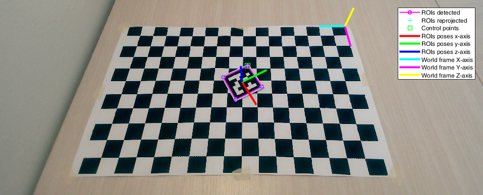

# Documentation

1. [Robot Calibration](#robot-calibration)
2. [Robot Vision](#robot-vision)
3. [Robot Control](#robot-control)

## Robot Calibration

Code to perform the calibration of the cameras and the robot with a checkerboard.

These functions assume the usual conventions to represent the pinhole model of a camera (in the following, **literature convention**). Namely, points on the image plane `m` and in space `M` are represented by column vectors. The projection equation (cf. the references of the project) takes the form `m = P*M = K*[R t]*M`, where `P` is the projection matrix, `K` the intrinsics matrix, and `[R t]` the extrinsics of the camera.

### Functions
<!-- acquire_calibration_images matlab function -->

    

        acquire_calibration_images
    

Acquire some images of a checkerboard from a set of fixed cameras at the same time. These images can be used to calibrate the cameras with the SMZ algorithm.

    images = acquire_calibration_images(n_images, cameras, dirs_images)

Input arguments:
+ **n_images**: number of the images to be acquired from each camera
+ **cameras**: cell array of camera objects (cf. webcam(...))
+ **dirs_images**: cell array with the directory paths where to save the images

Output arguments:
+ **images**: cell array of acquired images. images{i,j} is the i-th image acquired from the j-th camera

NOTE: this function requires the MATLAB Support Package for USB Webcams.

<!-- calibration_extrinsics_camera matlab function -->

    

        calibration_extrinsics_camera
    

Retrive the rotation matrix and the translation vector (extrinsics) of a camera wrt a world frame attached to a checkerboard.

    [R_cam, t_cam] = calibration_extrinsics_camera(cam, K, step_size, grid_arrangement, cm2px_scale, dir)

Input arguments:
+ **cam**:                webcam object (cf. webcam(...))
+ **K**:                  intrinsics matrix of the camera (literature convention)
+ **step_size**:          side of the squares of the checkerboard [cm]
+ **grid_arrangement**:   [x-steps y-steps] steps of the checkerboard along x,y axes
+ **cm2px_scale**:        dimension in cm of 1 pixel of the rectified image
+ **dir**:                directory where to write/read the calibration files

Output arguments:
+ **R_cam**: rotation matrix of the camera extrinsics in the world frame (literature convention)
+ **t_cam**: translation vector of the camera extrinsics in the world frame (literature convention)

NOTE: this function requires the following packages:
+ MATLAB Support Package for USB Webcams
+ Computer Vision Toolkit (http://www.diegm.uniud.it/fusiello/demo/toolkit/)

<!-- calibration_extrinsics_stereo matlab function -->

    

        calibration_extrinsics_stereo
    

Retrieve the extrinsics and epipolar matrices of a stereo pair. The two cameras are assumed with known intrinsics and extrinsics wrt the same world frame.

    [delta_R, delta_t, E, F] = calibration_extrinsics_stereo(K1, R1, t1, K2, R2, t2, dir)

Input arguments:
+ **K1**:         intrinsics matrix of the first camera (literature convention)
+ **R1**:         rotation matrix of the extrinsics of the first camera in the world frame (literature convention)
+ **t1**:         translation vector of the extrinsics of the first camera in the world frame (literature convention)
+ **K2**:         intrinsics matrix of the second camera (literature convention)
+ **R2**:         rotation matrix of the extrinsics of the second camera in the world frame (literature convention)
+ **t2**:         translation vector of the extrinsics of the second camera in the world frame (literature convention)
+ **dir**:        name of the directory where to save the results

Output arguments:
+ **delta_R**:    rotation matrix of the extrinsics of the stereo pair with the first camera as reference (literature convention)
+ **delta_t**:    translation vector of the extrinsics of the stereo pair with the first camera as reference (literature convention)
+ **E**:          essential matrix of the stereo pair (literature convention)
+ **F**:          fundamental matrix of the stereo pair (literature convention)

<!-- calibration_extrinsics_stereo_smz matlab function -->

    

        calibration_extrinsics_stereo_smz
    

Retrieve the extrinsics and epipolar matrices of a stereo pair. The two cameras are assumed to be previously jointly calibrated with the SMZ algorithm and with fixed relative position afterwards.

    [delta_R, delta_t, E, F] = calibration_extrinsics_stereo_smz(P1, K1, P2, K2, dir)

Input arguments:
+ **P1**:         cell array of projection matrices returned by SMZ calibration of the first camera (literature convention)
+ **K1**:         intrinsics matrix of the first camera (literature convention)
+ **P2**:         cell array of projection matrices returned by SMZ calibration of the second camera (literature convention)
+ **K2**:         intrinsics matrix of the second camera (literature convention)
+ **dir**:        name of the directory where to save the results

Output arguments:
+ **delta_R**:    rotation matrix of the extrinsics of the stereo pair with the first camera as reference (literature convention)
+ **delta_t**:    translation vector of the extrinsics of the stereo pair with the first camera as reference (literature convention)
+ **E**:          essential matrix of the stereo pair (literature convention)
+ **F**:          fundamental matrix of the stereo pair (literature convention)

<!-- calibration_intrinsics_camera matlab function -->

    

        calibration_intrinsics_camera
    

Retrive the intrisics and radial distortion parameters of a camera using a set of checkerboard images (SMZ algorithm).

    [P, K, intrinsics] = calibration_intrinsics_camera(n_intrinsics, n_radial_dist, step_size, grid_arrangement, cm2px_scale, dir_images)

Input arguments:
+ **n_intrinsics**:       number of intrisics to be calibrated (4, 5)
    + 4: fx, fy, u0, v0
    + 5: fx, fy, u0, v0, skew
+ **n_radial_dist**:      number of the distortion coefficient to be calibrated (1, 2)
+ **step_size**:          side of the squares of the checkerboard [cm]
+ **grid_arrangement**:   [x-steps y-steps] steps of the checkerboard along x,y axes
+ **cm2px_scale**:        dimension in cm of 1 pixel of the rectified images   
+ **dir_images**:         path of the directory containing the checkerboard images  

Output arguments:
+ **P**:                cell array of projection matrices associated to the checkerboard images (literature convention)
+ **K**:                calibrated intrisics matrix (literature convention)
+ **intrinsics**:       table with intrinsics and radial distortion parameters 

NOTE: this function requires the Computer Vision Toolkit (http://www.diegm.uniud.it/fusiello/demo/toolkit/)

<!-- check_epipolar matlab function -->

    

        check_epipolar_geometry
    

Acquire two points from the two images of a stereo pair and compute the Longuet-Higgins equation between them.

    test = check_epipolar_geometry(cam1, cam2, F)

Input arguments:
+ **cam1**: camera object of the first camera (cf. webcam(...))
+ **cam2**: camera object of the second camera (cf. webcam(...))
+ **F**: fundamental matrix of the stereo pair (cam1 assumed as reference)

Output arguments:
+ **test**: value of the Longuet-Higgins equation `p2'*F*p1`, where `p1`, `p2` are the points acquired from the first and second camera respectively (in homogeneous coordinates)

<!-- check_svd matlab function -->

    

        check_svd
    

SVD test to check if arrays are (numerically) linearly dependent.

    sigma_svd = check_svd(X)

Input arguments:
+ **X**: cell array of candidated linearly dependent arrays

Output arguments:
+ **sigma_svd**: singolar values of the concatenated arrays

<!-- get_extrinsics_camera matlab function -->

    

        get_extrinsics_camera
    

Retrieve the extrinsics of a set of cameras from their projection matrices and intrinsics matrices.

    [R, t, G] = get_extrinsics_camera(P, K) 

Input arguments:
+ **P**: cell array of projection matrices (literature convention)
+ **K**: cell array of intrinsics matrices (literature convention)

Output arguments:
+ **R**: cell array of rotation matrices (literature convention)
+ **t**: cell array of translation vectors (literature convention)
+ **G**: cell array of `[R t; 0 1]` matrices (literature convention)

<!-- print_countdown matlab function -->

    

        print_countdown
    

Plot on the screen the countdown of length seconds.

    print_countdown(length)

Input arguments:
+ **length**: duration of the countdown [s]

Usage examples can be found in [run_calibration_camera](../src/scripts/run_calibration_camera.m) and [run_calibration_stereo](../src/scripts/run_calibration_stereo.m).

## Robot Vision

Code to perform the detection and the pose estimation of Aruco markers in the scene.

These functions assume the Matlab conventions to represent the pinhole model of a camera (in the following, **Matlab convention**). Namely, points on the image plane `m` and in space `M` are represented by row vectors. The projection equation takes the form `m = M*P = M*[R; t]*P`, where `P, K, R, t` are the transposes of their counterparts in the literature convention.

We refer to **world frame** as the coordinate system XYZ wrt the camera extrinsics are calibrated (magenta-cyan-yellow axes in the image below). We refer to **ROI frame** (also, ROI pose) as the coordinate system xyz placed at the center of a marker such that its contol points is at `(-0.5,0.5,0)*side`, where `side` is the real length of the marker side (red-blue-green axes in the image below).

### Functions

<!-- aruco_detection matlab function -->

    

        aruco_detection
    

Build the Aruco detection pipeline. It executes in order the functions roi_extraction(...), roi_refinement(...), roi_matching(...).

    [rois_matched, i_arucos] = aruco_detection(img, aruco_markers, varargin)

Input arguments:
+ **img**: input image
+ **ruco_markers**: markers to be matched
+ **varargin**: collection of optional parameters, cf. the official Matlab documentation

Parameters:
+ **'verbose'**: verbose level of the function (0, 1)
    + 0: show nothing
    + 1: show log in the command window
+ Refer to roi_extraction(...), roi_refinement(...), roi_matching(...) for details about further allowed parameters.

Output arguments:
+ **rois_matched**: ROIs matched with the markers
+ **i_arucos**: indices of the markers matched with the rois_matched

<!-- aruco_pose_estimation matlab function -->

    

        aruco_pose_estimation
    

Build the Aruco pose estimation pipeline. It executes in order the functions aruco_detection(...), roi_pose_estimation(...).

    [rois, i_arucos, rois_R, rois_t] = aruco_pose_estimation(img, aruco_markers, aruco_real_sides, K, R_cam, t_cam, varargin)

Input arguments:
+ **img**:                input image
+ **aruco_markers**:      markers to be matched
+ **aruco_real_sides**:   real world lengths of the sides of the markers [cm]
+ **K**:                  intrisics matrix of the camera (Matlab convention)
+ **R_cam**:              rotation matrix of the camera extrinsics in the world frame (Matlab convention)
+ **t_cam**:              translation vector of the camera extrinsics in the world frame (Matlab convention)
+ **varargin**:           collection of optional parameters, cf. the official Matlab documentation

Parameters:
+ **'verbose'**: verbose level of the function (0, 1)
    + 0: show nothing
    + 1: show log in the command window
+ Refer to aruco_detection(...), roi_pose_estimation(...) for details about further allowed parameters

Output arguments:
+ **rois**:               ROIs matched with the markers
+ **i_arucos**:           indices of the markers matched with the rois
+ **rois_R**:             rotation matrices of the roto-translations that map points from the ROIs frames into the world frame (Matlab convention)
+ **rois_t**:             translation vectors of the roto-translations that map points from the ROIs frames into the world frame (Matlab convention)   

<!-- check_boundaries matlab function -->

    

        check_boundaries
    

Return 1 if the point (i, j) in pixel coordinates is inside an image, whose size is defined by img_size.

    check_ans = check_boundaries(i, j, img_size)

Input arguments:
+ **i**:          i point coordinate (row)
+ **j**:          j point coordinate (column)
+ **img_size**:   1x2 [rows img limit, columns img limit]

Output arguments:
+ **check_ans**:  1 if the point is inside the image 0 otherwise

<!-- check_quadrilateral matlab function -->

    

        check_quadrilateral
    

Check if the set of input points defines the shape of a valid quadrilateral, i.e., it is close to the shape of a parallelogram.

    is_valid_quad = check_quadrilateral(points, varargin)

Input arguments:
+ **points**:   array Nx2 of points that defines the shape [ [x1,y1]; [x2,y2]; ... ; [xN,yN] ]
+ **varargin**: collection of optional parameters, cf. the official Matlab documentation

Parameters:
+ **'sum_angles_tol'**: tolerance on the sum of the internal angles [degrees]
+ **'parallelism_tol'**: tolerance on the angle between opposite sides [degrees]
+ **'side_th_low'**: lower threshold on the length of each side [pixels]
+ **'side_th_high'**: higher threshold on the length of each side [pixels]

Output arguments:
+ **is_valid_quad**: 1 if the shape is a valid quadrilateral 0 otherwise

NOTE: a shape is discarded when one of the following conditions is met:
+ sum of the internal angles > 360° + sum_angles_tol 
+ angle between opposide sides > parallelism_tol
+ length of side lower than side_th_low
+ length of side greater than side_th_high

<!-- get_image matlab function -->

    

        get_image
    

Acquire an image from camera or load an image from disk.

    img = get_image(img_source)

Input arguments:
+ **img_source**: webcam object or path to an image on disk

Output arguments:
+ **img**: image acquired from the camera or loaded from disk

<!-- homography matlab function -->

    

        homography
    

Apply the homogeneous transformation H to the set of points X. The points are arranged by rows X = [x1; ... ; xN] and Y = [y1; ... ; yN]. The transformation acts on the homogeneous coordinates, hom(Y) = hom(X)*H.

    Y = homography(X, H)

Input arguments:
+ **X**: input set of points (inhomogeneous coordinates)
+ **H**: linear transformation between homogeneous coordinates (Matlab convention)

Output arguments:
+ **Y**: transformed set of points (inhomogeneous coordinates)

NOTE: the kind of transformation depends on the dimensions of H
+ H 4x3 is a projection 
+ H 3x3 is a transformation in the projective plane
+ H 4x4 is a transformation in the projective space

<!-- plot_aruco_markers matlab function -->

    

        plot_aruco_markers
    

Show the content of a set of Aruco markers.

    plot_aruco_markers(aruco_markers)

Input arguments:
+ **aruco_markers**: cell array containing the Aruco markers

<!-- pnp_lin matlab function -->

    

        pnp_lin
    

Perspective-n-Points (PnP) from 3D-2D correspondences. It finds the camera extrinsics R, t wrt the frame of the 3D points from a set of 3D-2D correspondences. The algorithm assumes coplanar 3D points, i.e. with z=0. Also the RMS value of the reprojection errors is returned.

    [R, t, reproj_err] = pnp_lin(X_image, X_world, K)
    
Input arguments:
+ **X_image**:    Nx2 array, 2D image points
+ **X_world**:    Nx3 array, 3D world points ( X_world(:,3) = 0 )
+ **K**:          intrisics matrix of the camera

Output arguments:
+ **R**:          rotation matrix of the camera extrinsics
+ **t**:          translation vector of the camera extrinsics
+ **reproj_err**: reprojection error (RMS value)

NOTE: Matlab convention is assumed, `X_image = X_world*[R; t]*K`.

<!-- pnp_nonlin matlab function -->

    

        pnp_nonlin
    

Non-linear refinement of Perspective-n-Points (PnP) from 3D-2D correspondences. It iterativelly refines the input camera extrinsics through inimization of the reprojection errors of a set of 3D-2D correspondences. Also the RMS value of the final reprojection errors is returned.

    [R, t, reproj_err] = pnp_nonlin(R0, t0, X_image, X_world, K)

Input arguments:
+ **R0**:         initial guess for the rotation matrix of the camera extrinsics, e.g., calculated with pnp_lin(...)
+ **t0**:         initial guess for the translation vector of the camera extrinsics, e.g., calculated with pnp_lin(...)
+ **X_image**:    Nx2 array, 2D image points
+ **X_world**:    Nx3 array, 3D world points
+ **K**:          intrisics matrix of the camera

Output arguments:
+ **R**:          rotation matrix of the (refined) camera extrinsics
+ **t**:          translation vector of the (refined) camera extrinsics
+ **reproj_err**: reprojection error (RMS value)

NOTE: Matlab convention is assumed, `X_image = X_world*[R; t]*K`.

<!-- reprojection_error matlab function -->

    

        reprojection_error
    

Reprojection error of a 3D-2D correspondence. It finds the component-wise reprojection error between a 2D point and a 3D point. The Jacobian wrt the extrinsics of the camera is also returned.

    [err, J_ext] = reprojection_error(m, M, K, R, t)

Input arguments:
+ **m**:      2D image point
+ **M**:      3D world point
+ **K**:      intrisics matrix of the camera
+ **R**:      rotation matrix of the camera extrinsics
+ **t**:      translation vector of the camera extrinsics

Output arguments:
+ **err**:    2x1 array, reprojection error between `m` and `reproj(M)`
+ **J_ext**:  2x12 array, Jacobian of err wrt the camera extrinsics `[R11,R21,R31,R12,R22,R32,R13,R23,R33,t1,t2,t3]`

NOTE: Matlab convention is assumed, `reproj(M) = M*[R; t]*K`.

<!-- roi_extraction matlab function -->

    

        roi_extraction
    

Extract ROIs from the input image.

    [rois_raw, time] = roi_extraction(img, img_gray, varargin)

Input arguments:
+ **img**:      input image
+ **img_gray**: input image (grayscale)
+ **varargin**: collection of optional parameters, cf. the official Matlab documentation

Parameters:
+ **'method'**: choose the ROI extraction algorithm
    + 'adaptth-moore': adaptive thresholding + Moore-Neighbor tracing 
    + 'canny-dfs': Canny edge detector + DFS
    + 'canny-dfs-c': Canny edge detector + DFS C-implementation   
+ **'adaptth_sensitivity'**: sensitivity of the adaptive thresholding, cf. adaptthresh(...)
+ **'adaptth_statistic'**:	statistic of the adaptive thresholding, cf. adaptthresh(...)		
+ **'adaptth_neighborhood'**:	neighborhood size of the adaptive thresholding, cf. adaptthresh(...)			
+ **'canny_th_low'**: lower threshold of the Canny edge detector, cf. edge(...)
+ **'canny_th_high'**: higher threshold of the Canny edge detector, cf. edge(...)		
+ **'verbose'**: verbose level of the function (0, 1, 2)
    + 0: show nothing
    + 1: show the extracted ROIs
    + 2: show also the binarized image (if 'adaptth-moore') or the Canny+DFS output (if 'canny-dfs')

Output arguments:
+ **rois_raw**: extracted ROIs without any refinement
+ **time**: execution time (ignoring plots)

<!-- roi_extraction_dfs matlab function -->

    

        roi_extraction_dfs
    

Apply the depth-first search (DFS) algorithm to a picture filtered with the Canny edge detector (2D-Graph) and extract the connected components from it (set of points, set of tails).

    components = roi_extraction_dfs(img_canny)

Input arguments:
+ **img_canny**: input image filtered by Canny edge detector

Output arguments:
+ **components**: cell array of the connected components (points and tails)
    + components{i,1} is the set of points of the i-th component
    + components{i,2} is the set of tails of the i-th component

<!-- roi_extraction_dfs_c matlab function -->

    

        roi_extraction_dfs_c
    

TODO

<!-- roi_matching matlab function -->

    

        roi_matching
    

Match the Aruco markers with the candidate ROIs.

    [rois_matched, i_rois_matched, i_arucos, time] = roi_matching(img, img_gray, rois, aruco_markers, varargin)

Input arguments:
+ **img**: input image
+ **img_gray**: input image (grayscale)
+ **rois**: candidated ROIs for matching with markers
+ **aruco_markers**: markers to be matched
+ **varargin**: collection of optional parameters, cf. the official Matlab documentation

Parameters:
+ **'roi_bb_padding'**: padding value of bounding boxes [pixels]
+ **'roi_h_side'**: side value of a ROI after homography [pixels]
+ **'roi_hamming_th'**: maximum value of hamming distance to detect a marker
+ **'verbose'**: verbose level of the function (0, 1, 2, 3)
    + 0: show nothing
    + 1: show the matched ROIs and the markers IDs
    + 2: show also the homographies of the matched ROIs
    + 3: show also the homographies of the unmatched ROIs

Output arguments:
+ **rois_matched**: matched ROIs among the candidated ROIs
+ **i_rois_matched**: indices of the rois_matched in the rois cell array
+ **i_arucos**: indices of the markers matched with the rois_matched
+ **time**: execution time (ignoring plots)

<!-- roi_pose_estimation matlab function -->

    

        roi_pose_estimation
    

Compute the poses of the matched ROIs in the world frame.

    [R, t, err_lin, err_nonlin, time] = roi_pose_estimation(img, rois, i_arucos, aruco_real_sides, K, R_cam, t_cam, varargin)

Input arguments:
+ **img**: input image
+ **rois**: ROIs matched with the markers
+ **i_arucos**: indices of the matched markers for every ROIs
+ **aruco_real_sides**: real world lengths of the sides of the markers [cm]
+ **K**: intrisics matrix of the camera (Matlab convention)
+ **R_cam**: rotation matrix of the camera extrinsics in the world frame (Matlab convention)
+ **t_cam**: translation vector of the camera extrinsics in the world frame (Matlab convention)
+ **varargin**: collection of optional parameters, cf. the official Matlab documentation

Parameters:
+ **'verbose'**: verbose level of the function (0, 1, 2)
    + 0: show nothing
    + 1: show the poses of the ROIs
    + 2: show also markers the IDs

Output arguments:
+ **R**: rotation matrices of the roto-translations that map points from the ROIs frames into the world frame (Matlab convention)
+ **t**: translation vectors of the roto-translations that map points from the ROIs frames into the world frame (Matlab convention)
+ **err_lin**: RMS values of reprojection errors (after linear PnP)
+ **err_nonlin**: RMS values of reprojection errors (after non-linear PnP)
+ **time**: execution time (ignoring plots)

<!-- roi_refinement matlab function -->

    

        roi_refinement
    

Refine and select the candidate ROIs for matching.

    [rois_refined, i_rois_refined, time] = roi_refinement(img, rois_raw, varargin)

Input arguments:
+ **img**: input image
+ **rois_raw**: input ROIs without any refinement
+ **varargin**: collection of optional parameters, cf. the official Matlab documentation

Parameters:
+ **'method'**: choose the ROI refinement algorithm
    + 'rdp': Ramer-Douglas–Peucker 
    + 'geometric': find the four extreme corners
+ **'roi_size_th'**: min #points required by each ROI to be processed
+ **'rdp_th'**: threshold of the Ramer-Douglas–Peucker algorithm, cf. reducepoly(...)
+ **'roi_sum_angles_tol'**: tolerance on the sum of the internal angles, cf. check_quadrilateral(...)
+ **'roi_parallelism_tol'**: tolerance on the angle between opposite sides, cf. check_quadrilateral(...)
+ **'roi_side_th_low'**: lower threshold on the length of each side normalized wrt the diagonal of the input image, cf. check_quadrilateral(...)
+ **'roi_side_th_high'**: higher threshold on the length of each side normalized wrt the diagonal of the input image, cf. check_quadrilateral(...)
+ **'verbose'**: verbose level of the function (0, 1, 2)
    + 0: show nothing
    + 1: show the refined ROIs
    + 2: show also the discarded ROIs

Output arguments:
+ **rois_refined**: refined and selected ROIs among the input ROIs
+ **i_rois_refined**: indices of the rois_refined in the rois_raw cell array
+ **time**: execution time (ignoring plots)

NOTE: to use Ramer-Douglas–Peucker ('rdp') Matlab >= 2019b is needed.

<!-- rpy2rot matlab function -->

    

        rpy2rot
    

Create a rotation matrix from its roll-pitch-yaw parameterization.

    [R, J_roll, J_pitch, J_yaw] = rpy2rot(a)

Input arguments:
+ **a**: [roll pitch yaw] parameterization of the rotation
    + a(1) = roll, rotation angle around x-axis
    + a(2) = pitch, rotation angle around y-axis
    + a(3) = yaw, rotation angle around z-axis

Output arguments:
+ **R**: rotation matrix, `R = Rx(roll)*Ry(pitch)*Rz(yaw)`
+ **J_roll**: Jacobian of R wrt roll
+ **J_pitch**: Jacobian of R wrt pitch
+ **J_yaw**: Jacobian of R wrt yaw

Usage examples can be found in [run_detection](../src/scripts/run_detection.m) and [run_pose_estimation](../src/scripts/run_pose_estimation.m).

## Robot Control

Code to perform trajectory planning, direct kinematics, inverse kinematics, control with Arduino.

### Functions

TODO